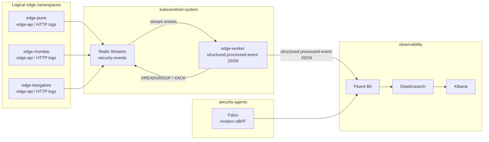
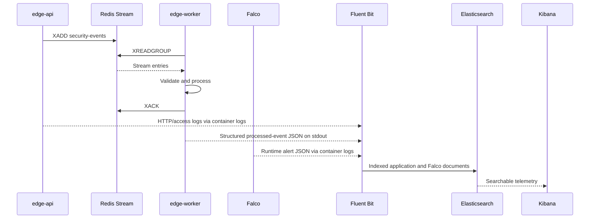
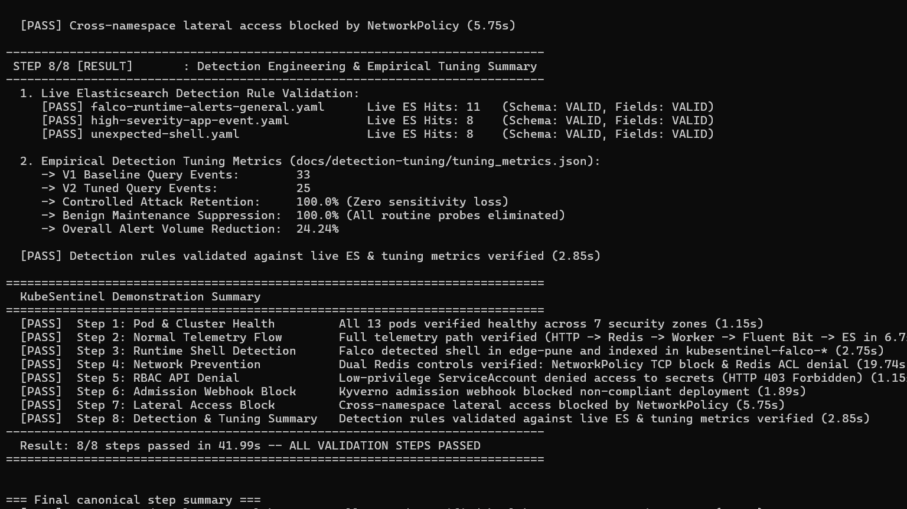
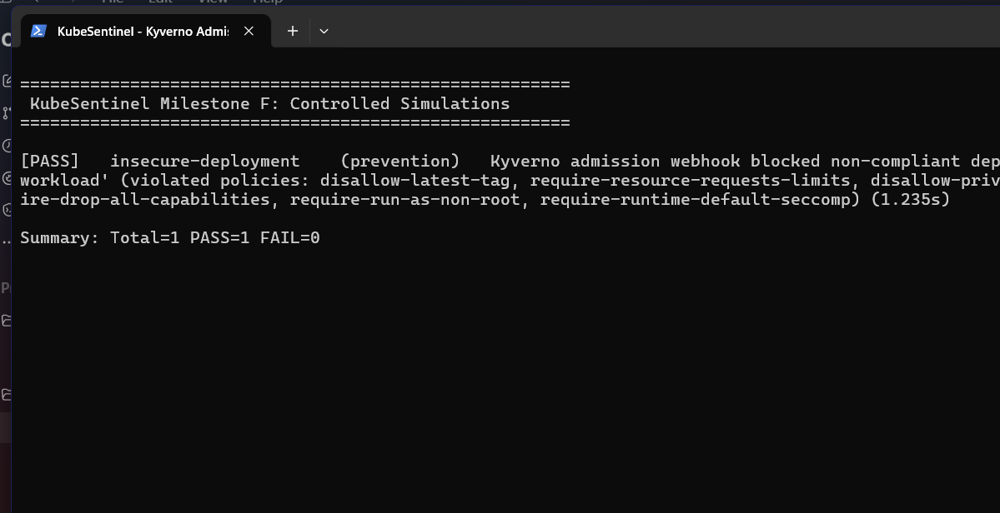
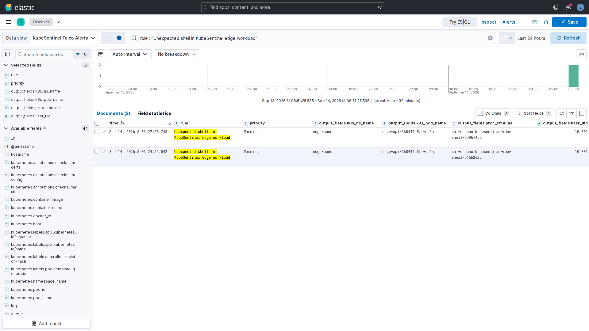

# KubeSentinel

[](https://github.com/dedsec-terminal/KubeSentinel/actions/workflows/ci.yml)
[](https://github.com/dedsec-terminal/KubeSentinel/actions/workflows/security.yml)
[](LICENSE)

KubeSentinel is a local-first cloud-native security engineering lab that deploys three simulated edge environments as isolated Kubernetes namespaces, streams authenticated security events through Redis, centralizes application and Falco runtime telemetry in Elastic, and enforces workload security through RBAC, NetworkPolicy, Pod Security Admission, and Kyverno.

## Validated Implementation

- **5/5 controlled security scenarios passed**, covering runtime detection, Redis access control, RBAC, admission policy, and cross-edge isolation.
- **298/298 automated tests pass** in the current checkout; the recorded integration run had 287/287.
- **9 Kyverno admission policies enforced** across the application namespaces.
- **Command-scoped Redis identities** separate producer, consumer, and bootstrap permissions.
- **Falco modern-eBPF alerts shipped to Elasticsearch** as structured runtime telemetry.
- **Detection tuning reduced 33 candidates to 25** while retaining 25/25 controlled shell events.
- **CI and security scanning run automatically** with GitHub Actions, Trivy, Checkov, Hadolint, and SBOM generation.

These are controlled local-lab results with deterministic, synthetic measurements. See the [validation snapshot](#validation), [sanitized evidence](docs/evidence), and [project limitations](#limitations).

## Overview

The lab models three logical edge sites—Pune, Mumbai, and Bangalore—as isolated namespaces in a single-node k3d cluster. Hardened FastAPI services publish security events to an authenticated Redis Stream, a central worker validates and acknowledges those events, and Fluent Bit routes application and Falco runtime telemetry to Elasticsearch for investigation in Kibana.

KubeSentinel combines preventive controls (Pod Security Admission, Kyverno, RBAC, NetworkPolicy, Redis ACLs, and restricted container settings) with detective controls (Falco and Elasticsearch hunting content). It is built for repeatable setup, testing, and learning on one machine.

## Architecture



Pod Security Admission and Kyverno evaluate workload configuration, NetworkPolicies restrict permitted flows, and Redis ACLs constrain stream commands. Infrastructure exceptions remain isolated: `observability` uses the `baseline` Pod Security profile, the pinned Kyverno controller namespace uses `privileged`, and Falco runs in `security-agents` with the host access needed for eBPF collection. Application workloads do not receive those privileges. The boundaries and scanner suppressions are documented in [the security model](docs/security-model.md).

## Security Model

| Layer | Control | Purpose |
| --- | --- | --- |
| Admission | Pod Security Admission profiles | Enforces `restricted` for application workloads and isolates infrastructure exceptions |
| Policy as code | Kyverno | Rejects privileged, root, unbounded, host-mounted, and mutable-tag workloads |
| Identity | Dedicated ServiceAccounts and zero-permission RBAC | Prevents unnecessary Kubernetes API access and token mounting |
| Network | Default-deny and allowlist NetworkPolicies | Limits ingress, egress, Redis access, and cross-edge traffic |
| Data plane | Redis ACL identities | Separates producer, consumer, and bootstrap command permissions |
| Container | Non-root UID, read-only root filesystem, dropped capabilities, seccomp | Reduces workload privileges and writable attack surface |
| Runtime | Falco with the modern eBPF probe | Detects selected syscall behavior and emits structured alerts |

See [docs/security-model.md](docs/security-model.md), [docs/network-security.md](docs/network-security.md), and [docs/threat-model.md](docs/threat-model.md) for assumptions, trust boundaries, and limitations.

## Telemetry Pipeline



Application records are indexed under `kubesentinel-app-*`; Falco alerts are indexed under `kubesentinel-falco-*`. The index templates and field contract are described in [docs/observability.md](docs/observability.md) and [detections/elastic/FIELDS.md](detections/elastic/FIELDS.md).

## Detection Engineering

The repository includes three Elasticsearch rule or hunt definitions:

- `Unexpected Shell Execution in Edge Workload` is a scoped detection rule mapped to MITRE ATT&CK `T1059.004` (Unix Shell).
- `High-Severity Security Event Triage` is a generic application and stream-processing triage rule. It intentionally has no ATT&CK mapping because severity alone does not establish a technique.
- `Falco Runtime Security Alerts General Hunt` is a broad multi-behavior hunting query. It intentionally has no single ATT&CK mapping; analysts pivot by Falco rule, namespace, process, and workload.

The final controlled tuning snapshot contained 33 candidate events: 25 controlled shell events and 8 benign maintenance candidates. The tuned query retained 25/25 controlled events, suppressed 8/8 benign candidates, and reduced candidate volume by 24.24%. These are deterministic measurements from the committed local-lab dataset; see [the tuning study](docs/detection-tuning/shell-detection.md).

## Visual Proof

The public evidence set ties the implementation to three high-signal views: the canonical scenario run, a Kyverno admission rejection, and a real Falco alert indexed in Kibana.

| Canonical run | Admission control |
| --- | --- |
|  |  |



These captures are sanitized local-lab evidence, not performance benchmarks. The [setup/network troubleshooting guide](docs/troubleshooting.md) covers the repeatable local access paths used to produce the same results.

## Technology Stack

| Component | Tested version | Role |
| --- | --- | --- |
| Kubernetes / k3d | k3s `v1.35.5-k3s1`, k3d `5.9.0` | Local cluster and namespace isolation |
| Python | `3.14.2` | Services, CLI, validators, and simulations |
| FastAPI / Uvicorn | Project-pinned dependencies | Edge event-ingest API |
| Redis | `7.4.2-alpine` | Authenticated stream and consumer group |
| Kyverno | chart `3.9.1`, app `v1.19.1` | Admission policy enforcement |
| Falco | `0.44.1` | Runtime syscall monitoring via modern eBPF |
| Fluent Bit | `3.2.4` | Kubernetes log enrichment and routing |
| Elasticsearch / Kibana | `8.17.3` | Local telemetry store and investigation UI |
| Trivy / Checkov / Hadolint | Pinned in workflows | Supply-chain, IaC, and Dockerfile checks |

Versions describe the validated environment; review the manifests and lock constraints before changing them.

## Controlled Security Scenarios

| Scenario | Result | Primary control | Telemetry boundary |
| --- | --- | --- | --- |
| Shell execution in an edge workload | Detected | Falco and Elasticsearch rule | Falco alert indexed in Elasticsearch |
| Unauthorized Redis access | Prevented | NetworkPolicy and Redis ACL | Socket/protocol result; no dedicated rejection index |
| Kubernetes API access with edge identity | Prevented | ServiceAccount and RBAC | API `403`; audit logs are not ingested |
| Non-compliant deployment | Prevented | Kyverno admission policy | Admission rejection; PolicyReports are not ingested |
| Cross-edge lateral connection | Prevented | Default-deny NetworkPolicy | Connection blocked; CNI flow logs are not ingested |

All scenarios are synthetic and designed for repeatable validation in the local lab.

## DevSecOps / Supply Chain

The [CI workflow](.github/workflows/ci.yml) runs the CI-safe pytest set, Ruff, Python compilation, YAML checks, Kyverno policy validation, Helm validation, and Hadolint. The [security workflow](.github/workflows/security.yml) runs Trivy filesystem, configuration, and image scans, Checkov IaC checks, and SBOM generation with least-privilege `contents: read` permissions. Third-party actions are pinned to immutable commit SHAs.

`python scripts/kubesentinel.py sbom` generates CycloneDX and SPDX documents plus SHA-256 metadata under the ignored `artifacts/sbom/` directory. The validation run generated 306 components across the two application images; generated SBOMs are reproducible release artifacts rather than committed source files.

## Quick Start

### Prerequisites

- Docker Desktop with the Linux container backend and WSL2 on Windows
- Python 3.11 through 3.14 (the recorded validation used 3.14.2)
- `kubectl`, `k3d`, and Helm
- Approximately 6 GB available to Docker for the complete observability stack

Check the current host before creating the lab:

```powershell
python scripts/kubesentinel.py doctor
```

Run the canonical lifecycle:

```powershell
python scripts/kubesentinel.py setup
python scripts/kubesentinel.py demo
python scripts/kubesentinel.py teardown
```

PowerShell wrappers are also available:

```powershell
.\scripts\setup.ps1
.\scripts\demo.ps1
.\scripts\teardown.ps1
```

The setup and teardown commands scope destructive actions to KubeSentinel resources. Review [docs/demo-guide.md](docs/demo-guide.md) before running the live scenarios.

If Docker Desktop cannot expose the k3d API or a dependency image is not present in the node runtime, use the [setup and network troubleshooting guide](docs/troubleshooting.md).

## Validation

A complete local integration validation recorded the following results. Additional unit coverage added afterward brings the current repository test count to 298:

| Check | Result |
| --- | ---: |
| Full pytest suite | 287/287 passed |
| CI-safe pytest suite | 265/265 passed; 22 integration tests deselected |
| Ruff / compileall | 0 findings / 0 errors |
| Environment doctor | 21 PASS, 2 WARN, 0 FAIL, 8 SKIP |
| Kubernetes baseline | 48/48 passed |
| NetworkPolicy validation | 32/32 passed |
| Kyverno admission validation | 19/19 passed |
| Observability validation | 11/11 passed |
| Falco runtime validation | 4/4 passed |
| Telemetry smoke test | Passed |
| Detection validation | 5/5 passed |
| Controlled simulations | 5/5 passed |
| Canonical demonstration | 8/8 steps passed in 56.09 seconds |
Sanitized command evidence is retained under [docs/evidence](docs/evidence). Counts are snapshots from the recorded validation environment and may change as the codebase evolves.

## Repository Structure

```text
KubeSentinel/
├── .github/workflows/       # CI and security workflows
├── apps/                    # edge-api, edge-worker, and shared event models
├── deploy/compose/          # Local Redis and Compose configuration
├── detections/elastic/      # Rule schema, field catalog, rules, and validator
├── docs/                    # Architecture, security, operations, evidence, and validation records
├── helm/third-party/        # Versioned Falco and Kyverno values
├── kubernetes/              # Namespaces, workloads, RBAC, networking, and observability
├── policies/kyverno/        # Admission policies
├── scripts/                 # Canonical lifecycle and validation tooling
├── simulations/             # Five controlled security scenarios
├── telemetry/               # Event schema and sanitized samples
└── tests/                   # Unit, CLI, schema, simulation, and integration tests
```

Local credentials, development notes, caches, generated SBOMs, kubeconfigs, and scratch tooling are excluded from Git.

## Resource Profile

The recorded validation ran on Windows 11 with WSL2, Docker Desktop configured with 6 CPUs and about 6.2 GB of memory, and a 512 MB Elasticsearch JVM heap. The host had about 15.7 GB of physical memory, so available headroom was monitored before cluster creation. Resource needs vary by platform and concurrent workload.

## Cost

KubeSentinel runs locally, so you can set it up and learn without paying for cloud resources or relying on a free trial.

## Limitations

- The validated topology is a single-node local k3d cluster; the three edge sites are logical namespaces, not independent regions or clusters.
- Scenarios and tuning data are controlled synthetic fixtures, so their rates describe this local dataset only.
- Kubernetes audit events, CNI flow/drop events, Redis authentication rejections, and Kyverno PolicyReports are not forwarded to Elasticsearch.
- Falco requires a narrowly scoped privileged DaemonSet for host-level collection; application workloads remain restricted.
- Elasticsearch is configured for a resource-constrained lab, not high availability, durable retention, or large-scale operation.
- The project is an educational security lab for local validation.

## Documentation

- [System architecture](docs/architecture.md)
- [Security model](docs/security-model.md)
- [Threat model](docs/threat-model.md)
- [Network security](docs/network-security.md)
- [Observability](docs/observability.md)
- [Falco runtime security](docs/falco-runtime-security.md)
- [Kyverno policies](docs/kyverno-policies.md)
- [Detection engineering](docs/detection-engineering.md)
- [Demonstration guide](docs/demo-guide.md)
- [Project validation record](docs/project-validation.md)

## License

Licensed under the [Apache License 2.0](LICENSE).
