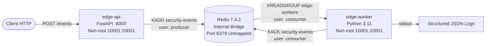

# KubeSentinel

Edge-to-SOC Security Intelligence & Automated Threat Containment Platform.

> [!NOTE]
> The description above represents the planned end-state V1 system. The repository has completed **Milestone B**. It implements and locally validates the complete vertical application data path (`edge-api → authenticated Redis Streams → edge-worker → structured JSON output → XACK`) under Docker Compose with hardened runtimes and least-privilege Redis ACLs. Kubernetes cluster deployment, Helm packaging, Elastic, Falco, and Kyverno are planned for future milestones.

---

## Architecture Overview (Milestone B)

Milestone B implements the vertical application telemetry ingestion pipeline:



### Key Highlights
- **Canonical Event Contract**: JSON Schema Draft 2020-12 (`v1.0`) enforced at ingest with server-side trusted identity injection (`schema_version`, `timestamp`, `event_id`, `edge_site`, `namespace`, `service`).
- **Authenticated Redis Streams**: Stream `security-events` with bounded retention (`MAXLEN ~ 10000`). Zero host port exposure (internal bridge network `kubesentinel-net` only).
- **Least-Privilege Redis ACLs**: Strict segregation between `producer` (`+auth +ping +xadd`), `consumer` (`+auth +ping +xreadgroup +xack`), and one-shot `bootstrap` (`+auth +ping +xgroup +xinfo +xpending`). Default user completely disabled.
- **Hardened Containers**: Minimal multi-stage Dockerfiles executing as non-root (`10001:10001`), `read_only: true` root filesystem, `cap_drop: [ALL]`, `security_opt: [no-new-privileges:true]`, and isolated tmpfs mounts.
- **Guaranteed Processing Semantics**: `XACK` executed strictly after validation and JSON logging. Malformed events emit error logs without acknowledgment, leaving entries pending in the Redis PEL for auditability.

---

## Quickstart & CLI Commands

All development tasks are managed via the canonical CLI tool `scripts/kubesentinel.py`.

### 1. Prerequisites
- Docker Desktop with Compose v2
- Python 3.14.2 with virtual environment `.venv`

### 2. Bootstrap Local Credentials
Generate cryptographically strong tokens and local Redis ACL configuration:
```powershell
.\.venv\Scripts\python.exe scripts/kubesentinel.py bootstrap-local
```
*(Creates `.env.local` and `deploy/compose/redis/users.acl`, both protected by `.gitignore`)*

### 3. Start Local Services
Launch the hardened Docker Compose stack:
```powershell
.\.venv\Scripts\python.exe scripts/kubesentinel.py compose-up
```
*(Automatically verifies Redis health, executes bootstrap consumer group initialization, and brings up `edge-api` and `edge-worker`)*

### 4. Run Deterministic End-to-End Smoke Test
Verify the complete data path from HTTP POST to Redis XACK:
```powershell
.\.venv\Scripts\python.exe scripts/kubesentinel.py smoke
```
*(Traces event ingest HTTP 202 -> Redis Stream XADD -> Worker consumption -> stdout JSON log -> PEL cleared with 0 pending entries)*

### 5. Stop Local Services
Tear down the Compose stack cleanly:
```powershell
.\.venv\Scripts\python.exe scripts/kubesentinel.py compose-down
```

---

## Developer Verification Commands

```powershell
# Environment health check (doctor diagnostics)
.\.venv\Scripts\python.exe scripts/kubesentinel.py doctor

# Code style and syntax check (Ruff & compileall)
.\.venv\Scripts\python.exe scripts/kubesentinel.py lint

# Automated test suite (all 177 unit & integration tests)
.\.venv\Scripts\python.exe scripts/kubesentinel.py test
```

---

## Documentation Index

- [Architecture Details](docs/architecture.md) — Vertical data path, event contract, and runtime topology.
- [Redis Security & ACL Architecture](docs/redis-security.md) — Least-privilege ACL rules, stream retention, and XACK invariants.
- [Environment & Dependencies](docs/environment.md) — Host prerequisites, container specifications, and port allocations.
- [Security Model](docs/security-model.md) — Container hardening, credential hygiene, and isolation boundaries.
- [Milestone B Evidence Ledger](docs/evidence/milestone-b/) — Sanitized execution logs (tests, lint, docker build, event flow).
