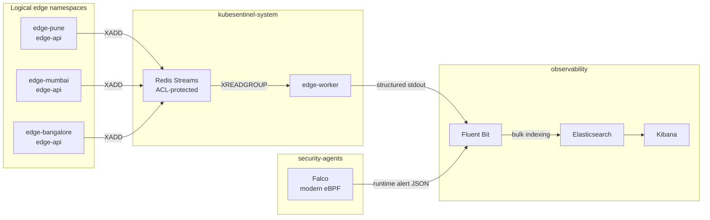

# KubeSentinel System Architecture & Design Specification (V1.0.0)

## 1. System Overview

KubeSentinel is a local Kubernetes security engineering and detection lab that combines workload hardening, policy-as-code admission enforcement, network segmentation, authenticated event streaming, kernel-level runtime monitoring through modern eBPF, and evidence-based detection tuning on a single-node cluster.

The architecture models a distributed edge-computing topology inside one local Kubernetes cluster. Three logical site namespaces (`edge-pune`, `edge-mumbai`, and `edge-bangalore`) publish validated security events through authenticated Redis Streams to central processing in `kubesentinel-system`. The `edge-worker` consumer group validates, enriches, and acknowledges each stream entry; Fluent Bit then routes application output and Falco modern-eBPF runtime alerts into separate Elasticsearch indices for investigation in Kibana. The sites represent namespace-level trust boundaries, not physical facilities or independent clusters.

---

## 2. Namespace Topology & Security Profile Matrix

The cluster is partitioned into seven namespaces with security profiles matched to each component's role:

| Namespace | Pod Security Level | Enforced Policies | Operational Function | Privileged Exceptions |
| :--- | :--- | :--- | :--- | :--- |
| `edge-pune` | **restricted** | PSA `restricted`, Kyverno `Enforce`, NetworkPolicy | Regional Edge Ingestion (Pune) | **None** (UID 10001, drop ALL, read-only root) |
| `edge-mumbai` | **restricted** | PSA `restricted`, Kyverno `Enforce`, NetworkPolicy | Regional Edge Ingestion (Mumbai) | **None** (UID 10001, drop ALL, read-only root) |
| `edge-bangalore` | **restricted** | PSA `restricted`, Kyverno `Enforce`, NetworkPolicy | Regional Edge Ingestion (Bangalore) | **None** (UID 10001, drop ALL, read-only root) |
| `kubesentinel-system` | **restricted** | PSA `restricted`, Kyverno `Enforce`, NetworkPolicy | Redis Streams, Bootstrap Job, `edge-worker` | **None** (Hardened Redis & Worker) |
| `kyverno` | **privileged** | Pinned upstream Helm release, admission controller RBAC | Admission webhook controllers and policy engine | Namespace-level PSA exception for the controller stack |
| `observability` | **baseline** | PSA `baseline`, NetworkPolicy | Fluent Bit, Elasticsearch, Kibana | Host volume mounts (`/var/log/pods`) for log collection |
| `security-agents` | **privileged** | PSA `privileged` (Explicit Exception) | Falco Modern eBPF Kernel Probe | **Documented Exception**: `privileged: true`, `hostPID: true`, eBPF subsystem access |

### Infrastructure Exception Disclosure

Application microservices enforce the `restricted` Pod Security profile. Infrastructure exceptions are kept in separate namespaces: `observability` uses `baseline` for read-only node-log collection, while the pinned Kyverno controller stack and `security-agents` use the `privileged` namespace profile in this lab. Falco itself runs with host privileges so the modern eBPF driver can attach to kernel tracepoints; those privileges are not granted to application workloads.

---

## 3. End-to-End Application Data Path

1. **Client Submission**: Untrusted clients submit event payloads via `POST /events` to `edge-api` on port 8000.
2. **Contract Validation & Identity Injection**:
   - `edge-api` validates the payload against `telemetry/schemas/security-event.schema.json`.
   - The server injects trusted infrastructure identity: `schema_version` (`1.0`), RFC3339 UTC `timestamp`, UUID `event_id`, regional `edge_site` (e.g. `pune`), and Downward API Kubernetes metadata (`pod`, `node`, `namespace`).
3. **Authenticated Ingestion**:
   - `edge-api` connects to Redis (`redis.kubesentinel-system.svc.cluster.local:6379`) using the `producer` ACL account.
   - Executes `XADD security-events MAXLEN ~ 10000 * event=<JSON>`.
   - Returns `202 Accepted` with correlation IDs (`event_id`, `stream_id`).
4. **Consumer Group Processing**:
   - `edge-worker` connects to Redis using the `consumer` ACL account and joins consumer group `edge-workers`.
   - Reads entries via `XREADGROUP GROUP edge-workers central-edge-worker-1 BLOCK 2000 STREAMS security-events >`.
   - Validates event schema, enriches with worker processing metadata (`log_type: security_event_processed`, `processed_at`), emits unbuffered structured JSON to stdout, and executes `XACK`.
5. **Log Processing & Ingestion**:
   - Container log lines are written to `/var/log/pods/` by the container runtime.
   - Fluent Bit tails the log files, applies the Kubernetes filter to extract pod metadata, parses the JSON payload, and routes the document to Elasticsearch index `kubesentinel-app-*` via HTTP `/_bulk`.

---

## 4. Multi-Layer Preventive Defenses

KubeSentinel implements an invariant preventive defense-in-depth model:

### Layer 1: Pod Security Admission (PSA)
- Workload namespaces enforce `pod-security.kubernetes.io/enforce: restricted`.
- Rejects non-compliant pods attempting root execution, capability additions, or privilege escalation at admission time.
- Validated continuously by negative fixture tests (`kubernetes/security/psa-negative-pod.yaml`).

### Layer 2: Kyverno Policy-as-Code Engine
- 9 `ClusterPolicy` definitions running in `validationFailureAction: Enforce` mode:
  1. `disallow-host-network`: Blocks `hostNetwork: true`.
  2. `disallow-privilege-escalation`: Forces `allowPrivilegeEscalation: false`.
  3. `disallow-privileged-containers`: Prohibits `privileged: true`.
  4. `require-drop-all-capabilities`: Requires `drop: ["ALL"]`.
  5. `require-run-as-non-root`: Enforces non-root container execution.
  6. `require-runtime-default-seccomp`: Requires the `RuntimeDefault` seccomp profile.
  7. `disallow-latest-tag`: Rejects images referencing mutable `:latest` tags.
  8. `require-resource-requests-limits`: Enforces CPU and memory limits.
  9. `disallow-host-path`: Blocks host directory mounts into application pods.

### Layer 3: Kubernetes Network Microsegmentation
- **Default-Deny Ingress & Egress**: All application namespaces block all traffic by default.
- **Microsegmented East-West Paths**:
  - `edge-api` pods are permitted egress strictly to CoreDNS (port 53) and Redis (port 6379).
  - Cross-edge traffic (e.g. `edge-pune` attempting to reach `edge-mumbai` on port 8000) is completely dropped.
  - Unauthorized pods attempting to probe Redis are blocked at the Linux netfilter/iptables layer.

### Layer 4: Redis Data Plane ACL Security
- Default user disabled (`user default off`).
- Least-privilege identities:
  - `producer`: Permitted only `+auth +ping +xadd ~security-events`. Denied all read and administrative commands.
  - `consumer`: Permitted only `+auth +ping +xreadgroup +xack ~security-events`. Denied write (`XADD`) and administrative commands.
  - `bootstrap`: Permitted only `+auth +ping +xgroup +xinfo +xpending ~security-events`. Used solely by ephemeral initialization Job.

### Layer 5: Kubernetes RBAC & Identity Hardening
- ServiceAccounts (`edge-api-sa`, `edge-worker-sa`, `redis-sa`) explicitly enforce `automountServiceAccountToken: false`.
- Zero Kubernetes Roles or ClusterRoles bound to workload identities. Any attempt to query the API server returns HTTP 403 Forbidden.

---

## 5. Runtime Detective Controls (Falco Modern eBPF)

Where preventive controls halt unauthorized operations before execution, **detective controls** observe runtime behavior and capture rich forensic context:

- **Probe Technology**: Falco 0.44.1 with the `modern_ebpf` engine attached to kernel tracepoints.
- **Rule Set**: Custom KubeSentinel ruleset targeting container execution anomalies:
  - `Unexpected shell in KubeSentinel edge workload`: Fires when `/bin/sh`, `/bin/bash`, or other command interpreters are spawned in edge containers.
- **Forensic Context**: Alerts capture monotonic timestamp, process command line (`proc_cmdline`), binary path (`proc_exepath`), parent process (`proc_pname`), user UID/GID (`10001`), container ID, pod name, and namespace.
- **Shipping Pipeline**: Falco writes structured JSON to container stdout. Fluent Bit tails the node's CRI container logs and forwards matching records to `kubesentinel-falco-*` in Elasticsearch.

---

## 6. Telemetry Gap Analysis & Grounding

A fundamental finding of KubeSentinel's architectural review is the **prevention vs. detection telemetry gap**:

- **Preventive controls** (NetworkPolicy drops, Kyverno rejections, Kubernetes RBAC 403s, Redis ACL denials) execute synchronously at the network, admission, or API boundary.
- **Standard Kubernetes does not index rejected operations**: Without specialized eBPF flow logging daemons (e.g. Cilium Hubble) or API audit webhooks, dropped packets and 403 responses do not generate SIEM documents.
- **Forensic Integrity**: KubeSentinel does not fabricate synthetic Elasticsearch detection rules for unindexed preventive events. Preventive controls are verified via CLI simulation probes, while detection rules are reserved for active telemetry streams.
