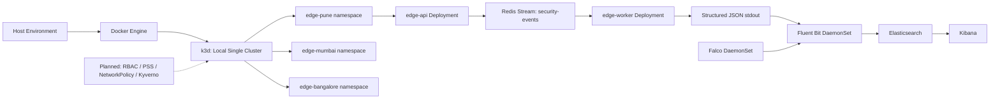

# Architecture — KubeSentinel

## 1. Executive Summary & Status

The KubeSentinel repository is currently at **Milestone B**. Milestone B establishes the foundational, containerized telemetry data pipeline locally under Docker Compose, validating the complete vertical flow before any Kubernetes cluster orchestration begins:

$$\text{Client HTTP POST} \longrightarrow \text{edge-api} \xrightarrow[\text{producer}]{\text{XADD}} \text{Redis Stream} \xrightarrow[\text{consumer}]{\text{XREADGROUP}} \text{edge-worker} \longrightarrow \text{JSON Log} \xrightarrow[\text{consumer}]{\text{XACK}} \text{Redis Stream}$$

---

## 2. Milestone B Vertical Application Data Path

```mermaid
flowchart TD
    subgraph Host ["Host Environment (127.0.0.1)"]
        Client[HTTP Ingestion Client]
    end

    subgraph ComposeBridge ["Docker Compose Bridge Network (kubesentinel-net)"]
        subgraph EdgeAPI ["edge-api (Container: 10001:10001, read-only rootfs)"]
            API_Rcv[POST /events Ingestion]
            API_Val[Input Validation & Sanitization]
            API_Inj[Inject Trusted Identity Metadata]
            API_Ser[Canonical JSON Serialization]
            API_Pub[Redis XADD Producer Client]
        end

        subgraph RedisSvc ["Redis 7.4.2 (Container: 999:1000, read-only rootfs, port 6379 unmapped)"]
            Stream[(Stream: security-events\nMAXLEN ~ 10000)]
            CG[Consumer Group: edge-workers]
            PEL[Pending Entries List - PEL]
        end

        subgraph EdgeWorker ["edge-worker (Container: 10001:10001, read-only rootfs)"]
            W_Sub[XREADGROUP Consumer Client]
            W_Val[Schema Validation Engine]
            W_Log[Single-Line JSON Logger]
            W_Ack[Redis XACK Acknowledgment Client]
        end
    end

    Client -->|HTTP POST /events :8000| API_Rcv
    API_Rcv --> API_Val
    API_Val --> API_Inj
    API_Inj --> API_Ser
    API_Ser --> API_Pub
    API_Pub -->|XADD security-events\nuser: producer| Stream
    Stream -.-> CG
    CG -->|XREADGROUP edge-workers\nuser: consumer| W_Sub
    W_Sub --> W_Val
    W_Val -->|Valid Event| W_Log
    W_Log -->|stdout| Stdout[Machine-Readable Log Stream]
    W_Log --> W_Ack
    W_Ack -->|XACK security-events\nuser: consumer| CG
    W_Ack -.->|Clear Entry| PEL
    W_Val -->|Malformed Event| ErrLog[Structured Error Log\n(NO XACK -> Entry Remains in PEL)]
```

### Step-by-Step Flow:
1. **HTTP Ingestion**: Client submits a JSON security event to `edge-api` via `POST /events`.
2. **Schema Validation & Untrusted Field Rejection**: `edge-api` validates user-supplied attributes (`event_type`, `severity`, `source`, `destination`, `message`, `metadata`). Disallowed client fields (`schema_version`, `timestamp`, `event_id`, `edge_site`, `namespace`, `service`, `pod`, `container`, `node`) are rejected with `422 Unprocessable Entity`.
3. **Trusted Metadata Injection**: `edge-api` injects verified server identity:
   - `schema_version`: `"1.0"`
   - `timestamp`: Current UTC timestamp in ISO-8601/RFC-3339 format with explicit timezone `Z`
   - `event_id`: Cryptographically random UUIDv4
   - `edge_site`: Configured local edge site (e.g. `pune`)
   - `namespace`: Configured local deployment namespace (e.g. `local-compose`)
   - `service`: `edge-api`
   - `pod`, `container`, `node`: Strictly `null` (no fabricated Kubernetes data)
4. **Redis Publication**: `edge-api` authenticates as the `producer` ACL identity and executes:
   ```redis
   XADD security-events MAXLEN ~ 10000 * event <serialized_canonical_json>
   ```
   Returns HTTP `202 Accepted` with correlation payload (`status`, `event_id`, `stream`, `stream_id`).
5. **Consumer Group Dispatch**: The stream entry is assigned to consumer group `edge-workers` and tracked in the Pending Entries List (PEL).
6. **Worker Processing**: `edge-worker` authenticates as `consumer` ACL identity, reading entries via non-busy blocking `XREADGROUP`:
   ```redis
   XREADGROUP GROUP edge-workers <worker_id> BLOCK 2000 COUNT 10 STREAMS security-events >
   ```
7. **Contract Validation**: Worker validates the entry against `telemetry/schemas/security-event.schema.json`.
8. **Logging & Acknowledgment**:
   - **Valid Event**: Emits a single-line unbuffered JSON record to `stdout` containing the event fields plus worker tracking metadata (`log_type: security_event_processed`, `processing_status: success`, `redis_stream_id`, `worker`, `processed_at`). Worker then executes:
     ```redis
     XACK security-events edge-workers <stream_id>
     ```
     Redis removes the entry from the PEL (verified PEL count = 0).
   - **Malformed Event**: Emits a structured error log (`log_type: security_event_processing_error`, `processing_status: error`, `raw_payload_preview`). Worker **deliberately skips XACK**, leaving the entry in the PEL for operational debugging and forensic review.

---

## 3. Event Contract Specification

The canonical event schema is versioned at `telemetry/schemas/security-event.schema.json` using JSON Schema Draft 2020-12.

### Schema Fields Matrix
| Field | Type | Source / Injection | Constraints / Format |
| :--- | :--- | :--- | :--- |
| `schema_version` | `string` | Trusted Server (`edge-api`) | Constant `"1.0"` |
| `timestamp` | `string` | Trusted Server (`edge-api`) | RFC 3339 / ISO 8601 UTC timestamp with `Z` |
| `event_id` | `string` | Trusted Server (`edge-api`) | UUIDv4 (`^[0-9a-f]{8}-[0-9a-f]{4}-4[0-9a-f]{3}-[89ab][0-9a-f]{3}-[0-9a-f]{12}$`) |
| `edge_site` | `string` | Trusted Server (`edge-api`) | Enum: `pune`, `mumbai`, `bangalore` |
| `namespace` | `string` | Trusted Server (`edge-api`) | Truthful local value: `local-compose` |
| `service` | `string` | Trusted Server (`edge-api`) | Constant `"edge-api"` |
| `event_type` | `string` | Untrusted Caller | Pattern `^[a-z0-9_]{3,64}$` |
| `severity` | `string` | Untrusted Caller | Enum: `info`, `low`, `medium`, `high`, `critical` |
| `source` | `string` | Untrusted Caller | String, 1 to 256 characters |
| `destination`| `string \| null` | Untrusted Caller | Optional, max 256 characters or null |
| `message` | `string` | Untrusted Caller | String, 1 to 1024 characters |
| `metadata` | `object` | Untrusted Caller | Arbitrary key-value object |
| `pod` | `null` | System Invariant | Strictly null (reserved for future k8s milestones) |
| `container` | `null` | System Invariant | Strictly null (reserved for future k8s milestones) |
| `node` | `null` | System Invariant | Strictly null (reserved for future k8s milestones) |

---

## 4. Redis Streams Architecture

- **Pinned Image**: `redis:7.4.2-alpine` (official digest: `sha256:02419de7eddf55aa5bcf49efb74e88fa8d931b4d77c07eff8a6b2144472b6952`).
- **Stream Key**: `security-events`.
- **Payload Design**: Single top-level field `event` storing the serialized JSON string. This avoids flat key-value degradation and allows nested metadata objects.
- **Bounded Retention**: Approximate trimming `MAXLEN ~ 10000` appended to every `XADD` command. Guarantees constant memory consumption in burst environments while retaining adequate event history.
- **Consumer Group**: `edge-workers`.
  - Created idempotently by ephemeral bootstrap container:
    ```bash
    redis-cli -h redis -p 6379 --user bootstrap -a "$REDIS_BOOTSTRAP_PASSWORD" XGROUP CREATE security-events edge-workers $ MKSTREAM
    ```

---

## 5. Consumer Group Semantics & Invariants

1. **At-Least-Once Delivery**: Messages delivered to consumer group `edge-workers` reside in the Pending Entries List (PEL) until explicitly acknowledged with `XACK`.
2. **Strict Ack-After-Processing Invariant**:
   - The worker MUST NOT acknowledge an entry before validation and log output.
   - If the worker crashes or terminates midway, the unacknowledged entry remains pending in the PEL and can be re-read via PEL recovery.
3. **Poison Pill Isolation**: Malformed or unparseable payloads do not crash the consumer loop. An error log is emitted and `XACK` is omitted, isolating bad entries in the PEL without halting the pipeline.
4. **Clean Signal Shutdown**: When `SIGTERM` or `SIGINT` is received, the worker finishes processing the current in-flight batch, closes Redis connections cleanly, and exits with code 0.

---

## 6. Container Hardening & Runtime Security

Both `edge-api` and `edge-worker` run under hardened runtime parameters enforced via multi-stage Dockerfiles and Docker Compose:

1. **Non-Root Execution**:
   - `edge-api`: User `appuser` (UID `10001:10001`), `/sbin/nologin`.
   - `edge-worker`: User `appuser` (UID `10001:10001`), `/sbin/nologin`.
   - `redis`: User `redis` (UID `999:1000`).
2. **Read-Only Root Filesystem**: `read_only: true` on all containers prevents malicious modification of system binaries or libraries.
3. **Dropped Capabilities**: `cap_drop: [ALL]` strips all Linux capabilities from container processes.
4. **No Privilege Escalation**: `security_opt: [no-new-privileges:true]` prevents child processes from gaining elevated permissions via setuid/setgid.
5. **Ephemeral Storage**: Writable mounts are restricted strictly to isolated `tmpfs` mounts (`/tmp:rw,noexec,nosuid,size=64m`).
6. **Network Isolation**:
   - Redis port `6379` is completely internal to Docker network `kubesentinel-net` (zero host port mapping).
   - Only `edge-api` port `8000` is published to `127.0.0.1:8000`.

---

## 7. Planned Target V1 (Deferred Beyond Milestone B)



> [!NOTE]
> Kubernetes cluster creation, Kubernetes manifests, Helm packaging, Elasticsearch, Kibana, Fluent Bit, Falco runtime detection, Kyverno admission control, and attack simulations are strictly deferred to future milestones.
