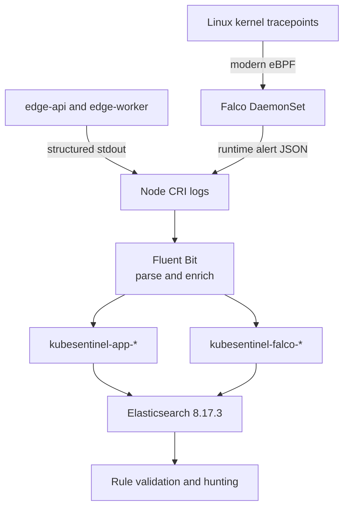

# KubeSentinel Detection Engineering Architecture & Guide

## 1. Overview & Pipeline Architecture

KubeSentinel's detection engineering workflow turns kernel-level events and application records into queryable security telemetry. The pipeline provides explicit typing, Kubernetes metadata enrichment, and separate application and runtime indices:



---

## 2. Field Catalog & Grounding (`FIELDS.md`)

All detection content is strictly grounded in real Elasticsearch documents verified on the live cluster. The complete catalog of fields, types, and sources is documented in `detections/elastic/FIELDS.md`.

### Key Runtime Security Fields (`kubesentinel-falco-*`)

| Field Path | Elastic Type | Description & Usage |
| :--- | :--- | :--- |
| `rule` | `keyword` | Exact Falco detection rule name (e.g. `Unexpected shell in KubeSentinel edge workload`). |
| `priority` | `keyword` | Falco alert priority level (`Emergency`, `Alert`, `Critical`, `Error`, `Warning`, `Notice`, `Informational`, `Debug`). |
| `source` | `keyword` | Alert event source (`syscall`, `k8s_audit`). |
| `output_fields.k8s_ns_name` | `text` (`.keyword`) | Kubernetes namespace where the event originated (`edge-pune`, `edge-mumbai`, `edge-bangalore`). |
| `output_fields.k8s_pod_name` | `text` (`.keyword`) | Name of the pod executing the syscall. |
| `output_fields.container_name`| `keyword` | Container name (`edge-api`, `edge-worker`). |
| `output_fields.proc_cmdline` | `text` (`.keyword`) | Full process command line. Note: `.keyword` is used in tuned detections to avoid tokenizer splitting across hyphenated flags. |
| `output_fields.proc_name` | `keyword` | Name of the spawned process (`sh`, `bash`, `ash`, `zsh`). |
| `output_fields.user_uid` | `long` | UID of the executing process (e.g. `10001` for hardened non-root workloads). |

### Key Application Security Fields (`kubesentinel-app-*`)

| Field Path | Elastic Type | Description & Usage |
| :--- | :--- | :--- |
| `event_id` | `keyword` | Unique UUIDv4 event identifier. |
| `edge_site` | `keyword` | Regional edge site identity (`pune`, `mumbai`, `bangalore`). |
| `service` | `keyword` | Generating microservice name (`edge-api`, `edge-worker`). |
| `severity` | `keyword` | Security event severity (`info`, `low`, `medium`, `high`, `critical`). |
| `log_type` | `keyword` | Structured log category (`security_event_processed`, `stream_processing_error`). |
| `processing_status` | `keyword` | Worker processing status (`success`, `rejected`, `stream_error`). |
| `redis_stream_id` | `keyword` | Redis Streams entry identifier (e.g. `1773491200000-0`). |
| `kubernetes.pod_name` | `keyword` | Downward API injected pod name. |
| `kubernetes.namespace_name` | `keyword` | Downward API injected namespace. |

---

## 3. Strict Rule Specification (`schema.json`)

All detection definitions in `detections/elastic/rules/` are authored in YAML and validated against `detections/elastic/schema.json` (JSON Schema Draft 7). Core operational metadata is required; `mitre_attack` is optional and is omitted when the telemetry does not support a specific technique:

```json
{
  "id": "Unique lowercase identifier matching ^[a-z0-9-]+$",
  "name": "Human-readable rule title",
  "description": "Clear explanation of detection objective",
  "severity": "low | medium | high | critical",
  "status": "production | experimental | deprecated | hunting",
  "index": "Index pattern targeted (e.g. kubesentinel-falco-*)",
  "language": "lucene | kql | eql | esql",
  "query": "Execution query string",
  "required_fields": ["Array of field paths required by this query"],
  "mitre_attack": [
    {
      "tactic": "MITRE ATT&CK tactic (e.g. execution)",
      "technique_id": "MITRE technique ID (e.g. T1059.004)",
      "technique_name": "MITRE technique name"
    }
  ],
  "hypothesis": "Testable security hypothesis",
  "investigation_guide": "Step-by-step SOC analyst investigation triage steps",
  "false_positives": ["Identified benign operational patterns"],
  "limitations": ["Documented evasion surfaces and blind spots"]
}
```

---

## 4. Production Detection Rules & Hunting Content

KubeSentinel includes three detection or hunting definitions under `detections/elastic/rules/`:

### Rule 1: Unexpected Shell in Edge Workload (`unexpected-shell.yaml`)
- **Index**: `kubesentinel-falco-*`
- **Target Tactic**: Execution (MITRE ATT&CK **T1059.004** Unix Shell)
- **Severity**: High
- **Query (Lucene)**:
  ```lucene
  rule:"Unexpected shell in KubeSentinel edge workload" AND output_fields.k8s_ns_name.keyword:("edge-pune" OR "edge-mumbai" OR "edge-bangalore")
  ```
- **Hypothesis**: KubeSentinel edge workloads do not normally execute interactive or one-shot shell interpreters (`sh`, `bash`, `ash`). A match requires investigation for controlled testing, authorized diagnostics, or unauthorized execution.
- **Controlled Simulation Validation**: Triggered and validated live by `python scripts/kubesentinel.py simulate shell`.

### Rule 2: High-Severity Application Event Triage (`high-severity-app-event.yaml`)
- **Index**: `kubesentinel-app-*`
- **ATT&CK Mapping**: None. Severity and processing status alone do not establish a specific adversary technique.
- **Severity**: High
- **Query (Lucene)**:
  ```lucene
  (severity:(high OR critical) OR processing_status:error)
  ```
- **Hypothesis**: High/critical events and stream-processing errors require review because they may result from application abuse, malformed input, upstream sensor failures, or pipeline faults.
- **Mapping Rationale**: Generic high-severity triage does not prove exploitation, denial of service, or any other technique without corroborating telemetry.

### Rule 3: General Falco Runtime Alerts Threat Hunt (`falco-runtime-alerts-general.yaml`)
- **Index**: `kubesentinel-falco-*`
- **ATT&CK Mapping**: None. The hunt spans heterogeneous Falco rules and behaviors.
- **Severity**: Medium
- **Status**: `hunting`
- **Query (Lucene)**:
  ```lucene
  priority:(Warning OR Error OR Critical OR Alert OR Emergency)
  ```
- **Hypothesis**: Elevated-priority Falco events warrant a contextual pivot by rule, workload, namespace, and process. A technique is assigned only after the behavior has been narrowed.

---

## 5. Honest Telemetry Gap Assessment

In strict accordance with detection engineering integrity, KubeSentinel evaluates potential detections against **real indexed telemetry**:

1. **NetworkPolicy Drops**: Packet drops occur at the Linux netfilter layer. Without an eBPF network flow daemon forwarding drop telemetry to Elasticsearch, zero documents are indexed.
2. **Kubernetes API RBAC Denials**: HTTP 403 Forbidden events are handled by the API server. In the absence of an API server audit webhook shipper, these events do not exist in Elasticsearch.
3. **Kyverno Admission Rejections**: Workloads rejected at the admission webhook boundary do not persist to etcd and do not emit Elasticsearch documents.
4. **Redis ACL Command Denials**: Redis returns `(error) NOPERM` over the RESP protocol. Redis command denials are not ingested into Elasticsearch.

> **Integrity Rule**: No synthetic or facade detection rules are created for unindexed preventative controls. Instead, preventative controls are verified directly via CLI simulations (`python scripts/kubesentinel.py simulate <scenario>`), while detection rules are reserved for active telemetry streams.

---

## 6. Empirical Detection Tuning Methodology

The empirical tuning study compares a broad baseline query (**V1**) with a refined, scoped query (**V2**).

### The Tokenization Problem in Lucene Wildcard Queries

In Elasticsearch, fields mapped as `text` are analyzed with standard tokenizers that split on punctuation and hyphens. A query searching for `*diag-maintenance*` on an analyzed field matches only single tokens (`diag`, `maintenance`), missing composite command strings.

By querying the exact `.keyword` subfield:
```lucene
output_fields.proc_cmdline.keyword:(*diag-maintenance* OR *healthcheck*)
```
the detection engine evaluates the raw un-tokenized string, enabling precise exclusion of benign diagnostic operations.

### Tuned Rule Formulation (V2)

```lucene
rule:"Unexpected shell in KubeSentinel edge workload"
AND output_fields.k8s_ns_name.keyword:("edge-pune" OR "edge-mumbai" OR "edge-bangalore")
AND output_fields.container_name.keyword:"edge-api"
AND output_fields.user_uid:10001
AND NOT output_fields.proc_cmdline.keyword:(*diag-maintenance* OR *healthcheck*)
```

### Empirical Results Summary (`tuning_metrics.json`)

| Metric | V1 Baseline | V2 Tuned | Improvement |
| :--- | :---: | :---: | :---: |
| **Total Candidate Events** | 33 | 25 | -24.24% candidate volume |
| **Controlled Scenarios Retained** | 25 / 25 (100.0%) | 25 / 25 (100.0%) | Zero controlled-scenario loss |
| **Benign Maintenance Events Suppressed** | 0 / 8 (0.0%) | 8 / 8 (100.0%) | 100.0% noise reduction |
| **Lab Noise Reduction** | 0.0% | **100.0%** | All routine probes eliminated |

---

## 7. Canonical Validation Tooling

Detection content is validated automatically via the canonical CLI:

```powershell
# Validate all rules against schema, FIELDS.md, live Elasticsearch queries, and tuning study
python scripts/kubesentinel.py detection-validate

# Emit machine-readable validation summary
python scripts/kubesentinel.py detection-validate --json

# Run offline validation (skip live Elasticsearch queries)
python scripts/kubesentinel.py detection-validate --no-es
```
