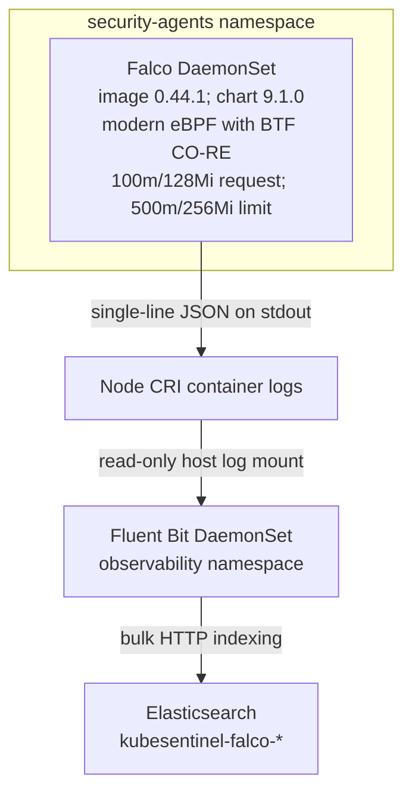

# Falco Runtime Security & Threat Detection Layer

This document describes Falco's architecture, driver selection, namespace isolation, custom detection rule, telemetry path, and runtime verification procedure in KubeSentinel.

---

## 1. Architecture Overview

Falco operates as the kernel-level runtime security instrumentation layer for KubeSentinel. Deployed as a `DaemonSet` in the dedicated, isolated `security-agents` namespace, Falco inspects system calls directly in the Linux kernel and emits real-time security alerts formatted as machine-readable JSON to stdout.



---

## 2. Namespace Isolation & Pod Security Admission (PSA)

### Dedicated Namespace: `security-agents`
Runtime monitoring agents require access to host syscall instrumentation and eBPF maps that are fundamentally incompatible with Kubernetes Pod Security Standards (PSA) `restricted` profiles.

To prevent privilege leakage into application workloads:
1. **Isolated Namespace**: Falco is deployed strictly in `security-agents` (`kubernetes/namespaces/security-agents.yaml`).
2. **Privileged Profile**: The namespace enforces `pod-security.kubernetes.io/enforce: privileged` (along with `audit: privileged` and `warn: privileged`).
3. **Application Workload Protection**: All application namespaces (`edge-pune`, `edge-mumbai`, `edge-bangalore`, and `kubesentinel-system`) remain strictly configured under PSA `restricted`.
4. **Kyverno Policy Isolation**: All cluster-wide Kyverno security policies in `policies/kyverno/` are explicitly scoped to application namespaces (`edge-pune`, `edge-mumbai`, `edge-bangalore`, `kubesentinel-system`), ensuring privileged system pods in `security-agents` and `kube-system` are neither falsely rejected nor allowed to bypass application controls.

---

## 3. Pinned Versions & Driver Selection

### Pinned Versions
- **Official Helm Chart**: `falcosecurity/falco` version `9.1.0` (repository `https://falcosecurity.github.io/charts`).
- **Application Image**: `docker.io/falcosecurity/falco:0.44.1` (pinned immutable tag, zero `:latest` usage).
- **Values Configuration**: Stored in `helm/third-party/falco-values.yaml` and mirrored at `kubernetes/security-agents/falco/values.yaml`.

### Driver Architecture: `modern_ebpf`
Falco supports multiple driver engines: kernel module (`kmod`), legacy eBPF (`ebpf`), and modern eBPF probe (`modern_ebpf`).
- **Driver Choice**: `driver.kind=modern_ebpf`.
- **WSL2 / Linux 6.18 Kernel Support**: The k3d cluster runs on a Linux 6.18.33.1 WSL2 kernel with full BTF (BPF Type Format) support present at `/sys/kernel/btf/vmlinux`.
- **Zero Kernel Header Compilation**: `modern_ebpf` uses Compile Once – Run Everywhere (CO-RE) relocations embedded in the Falco binary, requiring zero kernel headers and zero host kernel module compilation.
- **Resource Limits**:
  - CPU Request: `100m`, CPU Limit: `500m`.
  - Memory Request: `128Mi`, Memory Limit: `256Mi`.
- **Offline k3d Operation**: `falcoctl` artifact installation and follower sidecars are disabled (`falcoctl.artifact.install.enabled: false`, `falcoctl.artifact.follow.enabled: false`), preventing hanging network calls inside container networks lacking external internet routing.

---

## 4. Custom Threat Detection Rule: Unexpected Shell in Edge Workload

### Detection Hypothesis
KubeSentinel application containers run Python or Uvicorn entrypoints and do not normally spawn interactive or scripting shells (`sh`, `bash`, `ash`, `zsh`).

An attacker with code execution may spawn a shell to inspect the filesystem, read environment variables, or establish persistence. In this lab, a shell process inside an edge application container is a high-signal event that still requires context to distinguish controlled testing or authorized diagnostics from unauthorized execution.

### MITRE ATT&CK Mapping
- **Tactic**: Execution (`TA0002`)
- **Technique**: Command and Scripting Interpreter: Unix Shell (`T1059.004`)

### Rule Definition (`rules-kubesentinel.yaml`)
```yaml
- list: kubesentinel_edge_namespaces
  items: [edge-pune, edge-mumbai, edge-bangalore, kubesentinel-system]

- list: kubesentinel_allowed_shell_parents
  items: []

- rule: Unexpected shell in KubeSentinel edge workload
  desc: Detect unexpected shell spawning inside KubeSentinel edge workloads or system services (ATT&CK T1059.004)
  condition: >
    spawned_process and
    container and
    k8s.ns.name in (kubesentinel_edge_namespaces) and
    proc.name in (sh, bash, ash, zsh) and
    not proc.pname in (kubesentinel_allowed_shell_parents)
  output: >
    Unexpected shell spawned in KubeSentinel edge container (user=%user.name user_uid=%user.uid user_loginuid=%user.loginuid process=%proc.name parent=%proc.pname cmdline=%proc.cmdline container_id=%container.id container_name=%container.name k8s_pod=%k8s.pod.name k8s_ns=%k8s.ns.name)
  priority: WARNING
  tags: [mitre_execution, T1059.004, kubesentinel, container]
```

---

## 5. Output Formatting & Telemetry Pipeline

Falco is configured with stdout JSON output enabled:
```yaml
falco:
  json_output: true
  json_include_output_property: true
  stdout_output:
    enabled: true
```

### Emitted Event Format
Every detected syscall event outputs a single-line JSON record with discrete, structured metadata:
```json
{
  "hostname": "k3d-kubesentinel-server-0",
  "output": "14:24:54.137877987: Warning Unexpected shell spawned in KubeSentinel edge container (user=<NA> user_uid=10001 user_loginuid=-1 process=sh parent=<NA> cmdline=sh -c echo falco-test container_id=2e822ee84040 container_name=edge-api k8s_pod=edge-api-7db6db7d68-ft6jq k8s_ns=edge-pune) container_id=2e822ee84040 container_name=edge-api container_image_repository=docker.io/library/kubesentinel-edge-api container_image_tag=0.2.0 k8s_pod_name=edge-api-7db6db7d68-ft6jq k8s_ns_name=edge-pune",
  "output_fields": {
    "container.id": "2e822ee84040",
    "container.image.repository": "docker.io/library/kubesentinel-edge-api",
    "container.image.tag": "0.2.0",
    "container.name": "edge-api",
    "evt.time": 1789309494137877987,
    "k8s.ns.name": "edge-pune",
    "k8s.pod.name": "edge-api-7db6db7d68-ft6jq",
    "proc.cmdline": "sh -c echo falco-test",
    "proc.name": "sh",
    "proc.pname": null,
    "user.loginuid": -1,
    "user.name": "<NA>",
    "user.uid": 10001
  },
  "priority": "Warning",
  "rule": "Unexpected shell in KubeSentinel edge workload",
  "source": "syscall",
  "tags": [
    "T1059.004",
    "container",
    "kubesentinel",
    "mitre_execution"
  ],
  "time": "2026-09-13T14:24:54.137877987Z"
}
```

---

## 6. Verification & Operational Commands

### 1. Check Falco DaemonSet & Pod Health
```powershell
docker exec -i k3d-kubesentinel-server-0 kubectl get ds,pods -n security-agents -o wide
```
*Expected*: `falco` DaemonSet DESIRED: 1, CURRENT: 1, READY: 1; pod `1/1 Running`, `0 Restarts`.

### 2. Inspect Driver Startup & Syscall Ring Buffer Initialization
```powershell
docker exec -i k3d-kubesentinel-server-0 kubectl logs -n security-agents daemonset/falco | Select-String "Opening 'syscall' source with modern BPF probe" -Context 0,5
```
*Expected*: `Opening 'syscall' source with modern BPF probe.`, `One ring buffer every '2' CPUs.`, `schema validation: ok`.

### 3. Safe Runtime Attack Simulation
Execute a controlled shell execution inside the edge API pod in `edge-pune`:
```powershell
$POD = (docker exec -i k3d-kubesentinel-server-0 kubectl get pod -n edge-pune -l app.kubernetes.io/name=edge-api -o jsonpath='{.items[0].metadata.name}').Trim()
docker exec -i k3d-kubesentinel-server-0 kubectl exec -n edge-pune $POD -- sh -c "echo falco-test"
```
*Expected*: `falco-test` printed to stdout.

### 4. Verify Falco Emitted Real Alert
```powershell
docker exec -i k3d-kubesentinel-server-0 kubectl logs -n security-agents daemonset/falco --tail=20 | Select-String "Unexpected shell in KubeSentinel edge workload"
```
*Expected*: Single-line valid JSON record with `"rule": "Unexpected shell in KubeSentinel edge workload"`, `"priority": "Warning"`, `"k8s.ns.name": "edge-pune"`.

### 5. Run Automated Unit Tests
```powershell
.venv\Scripts\pytest tests/unit/test_falco_rules.py tests/unit/test_cli_observability.py -k falco -v
```
*Expected*: All tests pass cleanly.

---

## 7. Fluent Bit to Elasticsearch Ingestion Pipeline for Falco

Falco's structured JSON alerts emitted to container stdout are aggregated into Elasticsearch via Fluent Bit:

1. **Log Sourcing**:
   - Falco stdout logs are stored on the node filesystem at `/var/log/containers/falco-*_security-agents_falco-*.log`.
   - Fluent Bit mounts the node log directory read-only via a `PersistentVolume` / `PersistentVolumeClaim` pair.
2. **Tag Matching & Parsing**:
   - The tail input tags records as `kube.var.log.containers.falco-...`.
   - The dedicated parser filter matches `*falco*` and parses the JSON body, preserving root fields.
3. **Dedicated Output Sink**:
   - The Elasticsearch output plugin with `Match *falco*` directs alerts to the `kubesentinel-falco` index prefix.
   - Indices follow the daily format `kubesentinel-falco-YYYY.MM.DD`.
4. **Data View in Kibana**:
   - Configured data view `kubesentinel-falco-*` enables real-time visual threat analysis in Kibana Discover and Dashboards.

---

## 8. Canonical CLI Integration

Falco runtime validation is integrated directly into the canonical KubeSentinel CLI:

```powershell
# Validate Falco DaemonSet status, modern eBPF driver initialization, custom rules, and live alert detection
python scripts/kubesentinel.py falco-validate [--json]

# Execute end-to-end dual telemetry verification including Falco runtime alert to Elasticsearch
python scripts/kubesentinel.py telemetry-smoke [--timeout 45]
```

---

## 9. Security Agents NetworkPolicy

The `security-agents` namespace is protected by a strict default-deny NetworkPolicy:
- **`default-deny-all`**: Blocks all unauthorized ingress and egress traffic.
- **`allow-dns-egress`**: Permits DNS resolution to CoreDNS in `kube-system` on port 53 UDP/TCP.
- **`falco-health-policy`**: Allows internal TCP port 8765 ingress for Falco liveness and health checks.

---

## 10. Kyverno Policy Isolation & PSA Invariants

1. **Privilege Boundary**: Falco requires `privileged: true` and host access (`/host/proc`, `/sys/kernel`, container runtime sockets) to instrument system calls.
2. **Strict Scoping**: Pod Security Standards (PSA) `privileged` is granted strictly to the `security-agents` namespace.
3. **Kyverno Scoping**: All cluster-wide Kyverno admission policies (`policies/kyverno/`) enforce restrictive controls exclusively on application namespaces (`edge-pune`, `edge-mumbai`, `edge-bangalore`, `kubesentinel-system`), preventing privilege escalation while allowing security agents to operate unhindered.
