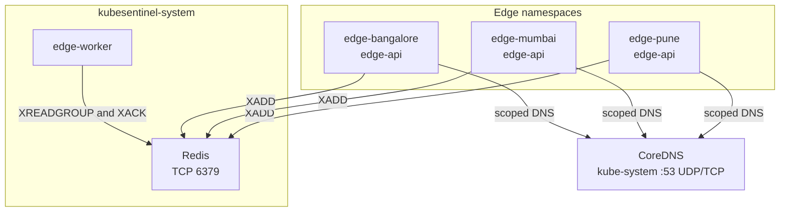

# KubeSentinel Kubernetes Network Security Architecture

## Overview
KubeSentinel uses Kubernetes `NetworkPolicy` segmentation across `edge-pune`, `edge-mumbai`, `edge-bangalore`, and `kubesentinel-system`. Networking is enforced at the packet layer by the k3s network policy controller (kube-router with Flannel CNI).

## Network Topology & Flows

## Policy Design

### 1. Default-Deny Ingress and Egress
Every protected namespace (`kubesentinel-system`, `edge-pune`, `edge-mumbai`, `edge-bangalore`) has a `default-deny-all` `NetworkPolicy` object selecting all pods (`podSelector: {}`) with `policyTypes: [Ingress, Egress]` and empty ingress/egress rule lists. All traffic into or out of the namespace is dropped unless explicitly permitted by an additive policy.

### 2. Narrowly Scoped DNS Resolution
Workloads must resolve Kubernetes service names (e.g., `redis.kubesentinel-system.svc.cluster.local`). The `allow-dns-egress` policy in each protected namespace explicitly allows outbound UDP and TCP on port 53 exclusively to pods labeled `k8s-app: kube-dns` in the `kube-system` namespace (`kubernetes.io/metadata.name: kube-system`). Broad outbound internet or cluster egress is not permitted.

### 3. Least-Privilege Redis Access
Central Redis runs in `kubesentinel-system` with a `ClusterIP` Service on port 6379. Redis ingress is strictly locked down via `redis-access`:
- Authorized Producers: Pods matching `app: edge-api` originating from namespaces `edge-pune`, `edge-mumbai`, or `edge-bangalore`.
- Authorized Consumer: Pods matching `app: edge-worker` in `kubesentinel-system`.
- Authorized Bootstrap: Ephemeral bootstrap Job pods matching `app: redis-bootstrap` in `kubesentinel-system`.
- Unauthorized workloads (e.g. `observability` namespace, non-edge workloads) are blocked at the network layer with a deterministic connection timeout/refusal.
- Redis has an empty egress rule list, preventing outbound network connections.

### 4. Cross-Edge Isolation
Edge APIs in Pune, Mumbai, and Bangalore must never communicate with each other. Because edge namespaces enforce default-deny egress (permitting only DNS and Redis) and default-deny ingress (permitting only local port 8000), cross-edge TCP requests (such as Pune attempting to connect to Mumbai on port 8000) are blocked at both egress and ingress boundaries.

## Note on Network Telemetry
KubeSentinel enforces packet filtering at the Linux kernel/CNI layer without a dedicated network flow logging system. Blocked flows appear as TCP timeouts or immediate resets. Fine-grained flow visualization such as Cilium Hubble is not implemented.
