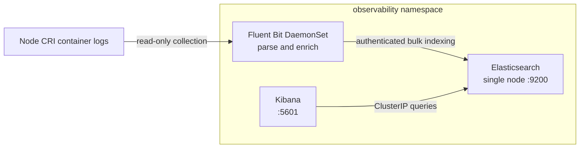
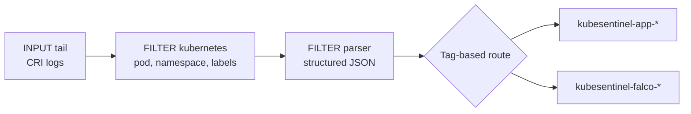

# KubeSentinel Observability Layer — Elasticsearch, Kibana & Fluent Bit

This document describes the architecture, sizing, credentials model, index templates, telemetry pipeline, and verification procedures for KubeSentinel's central observability stack.

---

## 1. Architectural Overview

The KubeSentinel observability stack provides centralized log aggregation, security event indexing, and dashboard visualization. It resides exclusively in the dedicated `observability` namespace with a Kubernetes Pod Security Standards (PSA) `baseline` enforcement profile.



### Components
1. **Elasticsearch Single-Node Deployment (`elasticsearch`)**:
   - Pinned image: `docker.elastic.co/elasticsearch/elasticsearch:8.17.3` (zero floating or `:latest` tags).
   - Mode: `discovery.type=single-node`.
   - Security: Native authentication enabled (`xpack.security.enabled=true`), auto-enrollment disabled (`xpack.security.enrollment.enabled=false`), plain internal HTTP enabled (`xpack.security.http.ssl.enabled=false`).
   - ClusterIP Service only (`elasticsearch:9200`). No NodePort, LoadBalancer, or hostPort.
   - Storage: Bounded development storage using an `emptyDir` volume mounted at `/usr/share/elasticsearch/data`.
   - Security context: UID 1000 (`elasticsearch`), `runAsNonRoot: true`, `capabilities: { drop: ["ALL"] }`, seccomp profile `RuntimeDefault`.

2. **Kibana Single-Replica Deployment (`kibana`)**:
   - Pinned image: `docker.elastic.co/kibana/kibana:8.17.3`.
   - Connected host: `http://elasticsearch:9200`.
   - ClusterIP Service only (`kibana:5601`).
   - Security context: UID 1000 (`kibana`), `runAsNonRoot: true`, `capabilities: { drop: ["ALL"] }`, seccomp profile `RuntimeDefault`.

3. **Fluent Bit DaemonSet (`fluent-bit`)**:
   - Pinned image: `fluent/fluent-bit:3.2.4`.
   - Pipeline: Tail CRI container logs (`/var/log/containers/*.log`), enrich with Kubernetes metadata via API server, decode structured edge-worker JSON into discrete first-class fields, and ship authenticated batches to Elasticsearch.
   - PSA Baseline compatibility: Read-only host log access via `PersistentVolume`/`PersistentVolumeClaim` (`storage.yaml`) preserving `pod-security.kubernetes.io/enforce: baseline`.
   - Security context: `allowPrivilegeEscalation: false`, `capabilities: { drop: ["ALL"] }`, seccomp profile `RuntimeDefault`.

---

## 2. Sizing & Resource Allocation

Memory allocations are strictly budgeted to avoid host memory pressure and container OOMKills in resource-constrained environments:

| Component | CPU Request | CPU Limit | Memory Request | Memory Limit | Runtime Heap / Buffer Pin |
|---|---|---|---|---|---|
| **Elasticsearch** | `250m` | `1000m` | `600Mi` | `1200Mi` | `-Xms512m -Xmx512m` (`ES_JAVA_OPTS`) |
| **Kibana** | `100m` | `500m` | `256Mi` | `512Mi` | `--max-old-space-size=400` (`NODE_OPTIONS`) |
| **Fluent Bit** | `50m` | `200m` | `64Mi` | `128Mi` | `Mem_Buf_Limit 15MB`, `Buffer_Size 10MB` |

### Startup & Liveness Strategy
- **Startup Probes**: Both Elasticsearch and Kibana define `startupProbe` with 60 failure thresholds (up to 300s grace window) so Kubernetes never terminates containers during JVM initialization or plugin bundle migration.
- **Readiness & Liveness Probes**: Lightweight socket probes (`tcpSocket: 9200`) for Elasticsearch and HTTP probes (`httpGet: /api/status: 5601`) for Kibana.

---

## 3. Credentials & Secrets Model

All credentials follow strict security and least-privilege standards:
- **Zero Committed Secrets**: Secrets are never checked into git. Local secrets reside in `.env.local` which is protected by `.gitignore`.
- **Secret Definition (`elasticsearch-credentials`)**:
  - Namespace: `observability`
  - Keys:
    - `username`: `elastic` (super-admin identity used by cluster setup and log forwarders).
    - `kibana_username`: `kibana_system` (reserved system account used by Kibana to avoid forbidden superuser write violations on system indices).
    - `password`: Cryptographically generated development password (`secrets.token_urlsafe(24)`).
- **Synchronization**: `scripts/deploy_observability.py` sets the `kibana_system` user password via the Elasticsearch Security API (`POST /_security/user/kibana_system/_password`) during automated deployment.

---

## 4. Structured Index Templates & Mappings

Two composable index templates (`priority: 200`, `number_of_shards: 1`, `number_of_replicas: 0`) ensure strong typing and fast searchability:

### 1. `kubesentinel-app` (`kubesentinel-app-*`)
Captures structured logs emitted by `edge-worker`:
- `timestamp`: `date`
- `@timestamp`: `date`
- `event_id`: `keyword`
- `edge_site`: `keyword`
- `namespace`: `keyword`
- `service`: `keyword`
- `event_type`: `keyword`
- `severity`: `keyword`
- `source`: `keyword`
- `destination`: `keyword`
- `message`: `text`
- `log_type`: `keyword`
- `processing_status`: `keyword`
- `redis_stream_id`: `keyword`
- `worker`: `keyword`
- `processed_at`: `date`
- `metadata`: `object` (dynamic)

### 2. `kubesentinel-falco` (`kubesentinel-falco-*`)
Captures runtime security alerts generated by Falco:
- `timestamp`: `date`
- `@timestamp`: `date`
- `time`: `date`
- `priority`: `keyword`
- `severity`: `keyword`
- `rule`: `keyword`
- `output`: `text`
- `source`: `keyword`
- `output_fields`: `object` (dynamic)

---

## 5. Kibana Data Views

Initialized via the Kibana Saved Objects Data Views API (`POST /api/data_views/data_view`):
1. **`kubesentinel-app`**:
   - Title: `kubesentinel-app-*`
   - Name: `KubeSentinel Applications`
   - Time field: `timestamp`
2. **`kubesentinel-falco`**:
   - Title: `kubesentinel-falco-*`
   - Name: `KubeSentinel Falco Alerts`
   - Time field: `time`

---

## 6. Verification & Operational Commands

### Automated Deployment & Setup
Run the end-to-end deployment script:
```powershell
python scripts/deploy_observability.py
```

### Manual Verification Commands

1. **Check Pod & Service Status**:
```powershell
docker exec -i k3d-kubesentinel-server-0 kubectl get pods,svc -n observability -o wide
```
Expected: Both `elasticsearch` and `kibana` pods `1/1 Running`, `0 Restarts`, ClusterIP services on `9200` and `5601`.

2. **Elasticsearch Cluster Health**:
```powershell
python -c "from scripts.setup_es_templates import request_es, get_es_credentials; u, p = get_es_credentials(); print(request_es('_cluster/health', username=u, password=p))"
```
Expected: HTTP status 200, `status: green`, `number_of_nodes: 1`.

3. **Verify Index Templates Registered**:
```powershell
python -c "from scripts.setup_es_templates import request_es, get_es_credentials; u, p = get_es_credentials(); print(request_es('_index_template/kubesentinel-app', username=u, password=p)[0]); print(request_es('_index_template/kubesentinel-falco', username=u, password=p)[0])"
```
Expected: Both return HTTP status 200.

4. **Verify Kibana Status**:
```powershell
python -c "from scripts.setup_es_templates import request_kibana, get_es_credentials; u, p = get_es_credentials(); print(request_kibana('api/status', username=u, password=p))"
```
Expected: HTTP status 200, `level: available`.

5. **Verify Kibana Data Views**:
```powershell
python -c "from scripts.setup_es_templates import request_kibana, get_es_credentials; u, p = get_es_credentials(); s, r = request_kibana('api/data_views', username=u, password=p); [print(dv['title'], dv['name']) for dv in r.get('data_view', [])]"
```
Expected: `kubesentinel-app-* KubeSentinel Applications` and `kubesentinel-falco-* KubeSentinel Falco Alerts`.

6. **Run Unit & Manifest Compliance Tests**:
```powershell
.venv\Scripts\pytest tests/unit/test_es_templates.py tests/unit/test_fluentbit_config.py -v
```
Expected: 11 passed.

7. **Verify Fluent Bit Ingestion End-to-End**:
```powershell
.venv\Scripts\python scripts/validate_fluentbit.py
```
Expected: HTTP 202 event submission, document found in `kubesentinel-app-*` with discrete fields, exit code 0.

---

## 7. Fluent Bit Telemetry Pipeline

Fluent Bit runs as a cluster-wide `DaemonSet` in the `observability` namespace, collecting container logs across all application namespaces (`edge-pune`, `edge-mumbai`, `edge-bangalore`, `kubesentinel-system`), parsing CRI containerd format, enriching logs with Kubernetes metadata, extracting structured JSON payloads emitted by `edge-worker`, and shipping authenticated log batches to Elasticsearch.

### Pipeline Architecture



### Configuration Specifications

1. **Service Definition (`[SERVICE]`)**:
   - `Flush 1`: Flushes buffer every 1 second for near real-time ingestion.
   - `Log_Level info`: Clean operational logging without debug noise.
   - `Parsers_File parsers.conf`: External parser definitions.
   - `Daemon off`: Runs in container foreground.

2. **Input Plugin (`[INPUT] tail`)**:
   - `Path /var/log/containers/*.log`: Captures all pod container logs.
   - `Parser cri`: Pinned regex matching containerd CRI log lines (`%Y-%m-%dT%H:%M:%S.%L%z %stream %flags %log`).
   - `Tag kube.*`: Tags records for Kubernetes filter matching.
   - `Mem_Buf_Limit 15MB`: Strict bounding prevents OOMKill during log bursts.
   - `Skip_Long_Lines On`: Protects buffer against oversize lines.
   - `Refresh_Interval 5`: Polling interval for newly created log files.

3. **Kubernetes Filter (`[FILTER] kubernetes`)**:
   - `Match kube.*`: Enriches all tagged container records.
   - `Merge_Log On` & `Keep_Log Off`: Parses embedded JSON in the `log` field and merges top-level keys into the record root, removing unparsed string duplication.
   - `K8S-Logging.Parser On` & `K8S-Logging.Exclude On`: Pod annotation support.
   - `Buffer_Size 64KB`: Safe buffer sizing for API server metadata responses.

4. **JSON Parser Filter (`[FILTER] parser`)**:
   - `Match kube.*edge-worker*`: Targets edge-worker records.
   - `Key_Name log`: Decodes structured JSON event records.
   - `Parser json`: Dedicated JSON parser.
   - `Reserve_Data On`: Preserves all Kubernetes metadata fields.

5. **Elasticsearch Sink (`[OUTPUT] es`)**:
   - `Host elasticsearch.observability.svc.cluster.local`, `Port 9200`: Authenticated internal ClusterIP connectivity.
   - `HTTP_User ${ES_USER}` & `HTTP_Passwd ${ES_PASSWORD}`: Secure credentials injected from `elasticsearch-credentials` Secret.
   - `Logstash_Format On` & `Logstash_Prefix kubesentinel-app`: Indices formatted as `kubesentinel-app-YYYY.MM.DD`.
   - `Replace_Dots On`: Replaces dots in JSON keys with underscores to prevent Elasticsearch mapping collision.
   - `Suppress_Type_Name On`: Elasticsearch 8.x compatibility.
   - `Buffer_Size 10MB` & `Retry_Limit 5`: Bounded backoff retry policy.

### PSA Baseline Compliance Model

Under Kubernetes Pod Security Standards (PSA) `baseline`, direct `hostPath` volumes in pod templates are rejected by the admission controller. Fluent Bit achieves 100% PSA `baseline` compliance while reading host container logs through a dedicated `PersistentVolume` and `PersistentVolumeClaim` pair (`storage.yaml`):
- `PersistentVolume` (`fluent-bit-varlog`): Cluster-scoped object referencing hostPath `/var/log` (`ReadOnlyMany`).
- `PersistentVolumeClaim` (`fluent-bit-varlog`): Namespaced in `observability`, requested by the DaemonSet pod (`claimName: fluent-bit-varlog`).
- Because `persistentVolumeClaim` is an explicitly permitted volume type in PSA `baseline`, the DaemonSet runs cleanly with 0 restarts and full access to container log files.

### Discrete Fields Ingestion Verification

Structured JSON logs emitted by `edge-worker` are decoded into discrete first-class fields matching the `kubesentinel-app` index template:
- `event_id`: Unique event UUID.
- `edge_site`: Originating edge site (`pune`, `mumbai`, `bangalore`).
- `severity`: Event severity (`info`, `low`, `medium`, `high`, `critical`).
- `log_type`: Processing log type (`security_event_processed`).
- `processing_status`: Status indicator (`success` or `error`).
- `redis_stream_id`: Upstream Redis Stream message ID.
- `worker`: Consumer worker identity (`central-edge-worker-1`).
- `timestamp`: RFC3339 event timestamp.
- `processed_at`: RFC3339 processing completion timestamp.
- `kubernetes`: Nested metadata object (`pod_name`, `namespace_name`, `container_name`, `labels`, `host`).

---

## 8. Dual Index Routing & Output Separation

Fluent Bit dynamically routes incoming container logs into separated Elasticsearch daily indices based on origin tags and container identities:

1. **Application Event Logs (`kubesentinel-app-*`)**:
   - Matches: `*edge*` (captures `edge-worker` and `edge-api` container logs).
   - Parsing: CRI parser unwraps container logs, Kubernetes filter injects cluster metadata, and JSON parser unwraps structured worker events.
   - Elasticsearch Index Prefix: `kubesentinel-app` (resulting in `kubesentinel-app-YYYY.MM.DD`).
   - Mapped Template: `kubesentinel-app` (priority 200).

2. **Runtime Security Alerts (`kubesentinel-falco-*`)**:
   - Matches: `*falco*` (captures Falco security sensor container logs from `security-agents`).
   - Parsing: JSON parser extracts top-level fields (`rule`, `priority`, `output`, `output_fields`, `time`, `source`, `tags`).
   - Elasticsearch Index Prefix: `kubesentinel-falco` (resulting in `kubesentinel-falco-YYYY.MM.DD`).
   - Mapped Template: `kubesentinel-falco` (priority 200).

---

## 9. Observability & Security NetworkPolicies

The `observability` and `security-agents` namespaces are secured under Kubernetes native `NetworkPolicy` resources enforcing default-deny ingress and egress:

1. **Observability Namespace (`kubernetes/network/observability-policy.yaml`)**:
   - `default-deny-all`: Restricts all non-explicit ingress and egress for pods in `observability`.
   - `allow-dns-egress`: Allows UDP/TCP port 53 egress to CoreDNS in `kube-system`.
   - `elasticsearch-policy`: Allows TCP port 9200 ingress strictly from `fluent-bit`, `kibana`, and internal cluster workloads.
   - `kibana-policy`: Allows TCP port 5601 ingress and TCP port 9200 egress to `elasticsearch`.
   - `fluent-bit-policy`: Allows TCP port 9200 egress to `elasticsearch` and TCP port 443/6443 egress to the Kubernetes API server for metadata enrichment.

2. **Security Agents Namespace (`kubernetes/network/security-agents-policy.yaml`)**:
   - `default-deny-all`: Restricts all ingress and egress by default in `security-agents`.
   - `allow-dns-egress`: Allows UDP/TCP port 53 egress to CoreDNS in `kube-system`.
   - `falco-health-policy`: Allows TCP port 8765 ingress for Falco internal health probes.

---

## 10. Canonical CLI Extensions

Observability and runtime security operations are integrated into the canonical KubeSentinel CLI:

```powershell
# Deploy Elasticsearch, Kibana, index templates, data views, Fluent Bit, Falco, and NetworkPolicies in validated sequence
python scripts/kubesentinel.py observability-deploy

# Validate cluster health, index templates, Kibana availability, Fluent Bit DaemonSet, and Falco driver status
python scripts/kubesentinel.py observability-validate [--json]

# Execute dual end-to-end telemetry smoke tests (App HTTP event -> ES & Falco runtime alert -> ES)
python scripts/kubesentinel.py telemetry-smoke [--timeout 45]

# Validate Falco deployment, modern eBPF driver, custom rule, and execute a controlled runtime alert
python scripts/kubesentinel.py falco-validate [--json]
```

---

## 11. Dual End-to-End Telemetry Verification Proofs

### Proof 1: Application Telemetry Pipeline
1. **Event Submission**: Client submits a JSON security event via `POST /events` to `edge-api` in `edge-pune`.
2. **Ingestion & Queuing**: `edge-api` accepts the request (HTTP 202) and appends it to Redis stream `security-events` via `XADD`.
3. **Processing & Ack**: Central `edge-worker` in `kubesentinel-system` consumes the message via `XREADGROUP`, processes it, emits structured single-line JSON to stdout, and acknowledges via `XACK`.
4. **Log Collection**: Fluent Bit tails container stdout logs, parses CRI and JSON payloads, attaches Kubernetes metadata (`pod_name`, `namespace_name`), and forwards the document to Elasticsearch index `kubesentinel-app-*`.
5. **Verification**: Direct Elasticsearch query confirms document presence with matching `event_id`, `edge_site`, `severity`, `log_type`, `processing_status`, `redis_stream_id`, `worker`, `timestamp`, and `kubernetes` metadata.

### Proof 2: Runtime Security Telemetry Pipeline
1. **Trigger**: Controlled command execution (`sh -c "echo falco-proof-..."`) occurs inside an edge container (`edge-pune`).
2. **Kernel Detection**: Falco's `modern_ebpf` probe observes the `execve` syscall, evaluates the custom rule "Unexpected shell in KubeSentinel edge workload" (ATT&CK `T1059.004`), and outputs a structured JSON alert to container stdout.
3. **Log Collection & Routing**: Fluent Bit tails Falco's container logs, tags them with `kube.*falco*`, parses JSON fields, and routes them via output sink to Elasticsearch index `kubesentinel-falco-*`.
4. **Verification**: Elasticsearch query confirms document indexing in `kubesentinel-falco-*` with verified `rule`, `priority`, `source`, `time`, `output_fields.k8s_ns_name`, and process command line.
