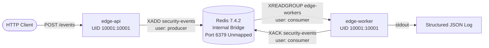
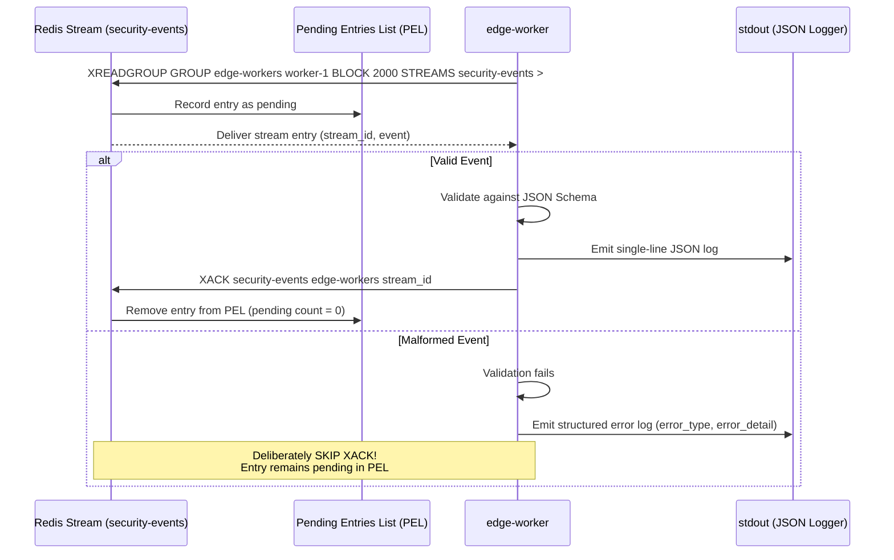

# Redis Security & Stream Architecture — Milestone B

## 1. Executive Summary

Milestone B establishes the first real application telemetry transport for KubeSentinel: an authenticated, least-privilege Redis Streams pipeline connecting `edge-api` (producer) to `edge-worker` (consumer) under Docker Compose.



---

## 2. Redis Stream Topology & Retention Rules

### Stream Specification
- **Stream Key**: `security-events`
- **Field Name**: `event=<serialized canonical JSON>`
  - The serialized canonical JSON document contains all validated event attributes and server-injected metadata.
  - Retains nested metadata structures without lossy flat-stringification.
- **Retention Strategy**: Bounded retention using approximate trimming:
  ```redis
  XADD security-events MAXLEN ~ 10000 * event <payload>
  ```
  - `MAXLEN ~ 10000` enforces an approximate limit of 10,000 entries using Redis macro-nodes for computational efficiency.
  - Guarantees constant memory consumption in burst environments while preventing Out-of-Memory (OOM) failures in local development.
- **Consumer Group**: `edge-workers`
  - Created idempotently by the ephemeral `redis-bootstrap` service:
    ```bash
    redis-cli -h redis -p 6379 --user bootstrap -a "$REDIS_BOOTSTRAP_PASSWORD" XGROUP CREATE security-events edge-workers $ MKSTREAM || true
    ```
  - `MKSTREAM` automatically creates the stream if it does not yet exist.
  - Consumers read from the group using blocking semantics:
    ```redis
    XREADGROUP GROUP edge-workers <consumer-id> BLOCK 2000 COUNT 10 STREAMS security-events >
    ```

---

## 3. Redis Access Control Lists (ACL) Architecture

Redis 7.4.2 runs with strict ACL enforcement configured via `deploy/compose/redis/users.acl`. Default unauthenticated access is completely disabled.

### ACL Least-Privilege Matrix

| Identity | Status | Command Permissions | Allowed Keys | Description & Invariants |
| :--- | :--- | :--- | :--- | :--- |
| **`default`** | **Disabled** (`off`) | `-@all` | (none) | Unauthenticated commands and legacy anonymous connections are rejected immediately. |
| **`producer`** | Active (`on`) | `+auth +ping +xadd` | `~security-events` | Used strictly by `edge-api`. Permitted to authenticate, check connectivity via `PING`, and publish events via `XADD`. Cannot read entries (`XREAD`/`XREADGROUP`), cannot acknowledge (`XACK`), cannot inspect administrative commands or access any other key pattern. |
| **`consumer`** | Active (`on`) | `+auth +ping +xreadgroup +xack` | `~security-events` | Used strictly by `edge-worker`. Permitted to authenticate, check connectivity via `PING`, consume stream entries via `XREADGROUP`, and acknowledge completed items via `XACK`. Cannot publish (`XADD`), cannot administer Redis, and cannot read other keys. |
| **`bootstrap`**| Active (`on`) | `+auth +ping +xgroup +xinfo +xpending` | `~security-events` | Ephemeral administrative identity used solely to create the `edge-workers` consumer group and inspect the Pending Entries List (PEL). Never utilized by long-running application services. |

### ACL Configuration File Template (`users.acl`)
```acl
user default off nopass -@all
user producer on >${REDIS_PRODUCER_PASSWORD} ~security-events +auth +ping +xadd
user consumer on >${REDIS_CONSUMER_PASSWORD} ~security-events +auth +ping +xreadgroup +xack
user bootstrap on >${REDIS_BOOTSTRAP_PASSWORD} ~security-events +auth +ping +xgroup +xinfo +xpending
```

---

## 4. Insecure vs. Hardened Configuration Comparison

| Dimension | Insecure Default (Anti-Pattern) | KubeSentinel Hardened Implementation (Milestone B) |
| :--- | :--- | :--- |
| **Authentication** | None (open default port) | Strict ACL authentication with distinct 256-bit cryptographically random tokens per role. |
| **Network Exposure**| Published to `0.0.0.0:6379` | Unmapped internal bridge network only (`kubesentinel-net`); zero host port exposure. |
| **Account Privileges**| Shared single root/admin account (`+@all`) | Segregated `producer`, `consumer`, and `bootstrap` roles with minimal command whitelisting. |
| **Key Namespace Access**| Unrestricted key wildcard (`~*`) | Key access restricted strictly to stream key `~security-events`. |
| **Stream Retention**| Unbounded (OOM hazard) | Bounded with approximate trimming `MAXLEN ~ 10000`. |
| **Runtime User**| Container runs as root (UID 0) | Container runs as unprivileged `redis` user (UID `999:1000`). |
| **Linux Capabilities**| Full Linux capability set | `cap_drop: [ALL]`, `read_only: true`, `security_opt: [no-new-privileges:true]`. |

---

## 5. Secret Handling & Credential Hygiene

- **Cryptographic Generation**: Tokens are generated via `python scripts/kubesentinel.py bootstrap-local` using `secrets.token_urlsafe(32)`.
- **Restricted File Storage**: Secrets are stored in `.env.local` and `deploy/compose/redis/users.acl` with restrictive file permissions (`0600`).
- **Version Control Exclusion**: Both files are strictly ignored via `.gitignore` and verified by automated unit tests (`tests/unit/test_git_status.py`).
- **Zero Log Leakage**: CLI scripts and application handlers sanitize credentials, preventing secrets from appearing in container logs, stdout, or evidence artifacts.

---

## 6. Consumer Group Semantics & The XACK Invariant



### The XACK-After-Processing Invariant
1. **At-Least-Once Delivery**: Redis tracks delivered entries in the Pending Entries List (PEL) until an explicit `XACK` command is received.
2. **Deterministic Processing**:
   - `edge-worker` validates each payload against `telemetry/schemas/security-event.schema.json`.
   - On valid events: The worker writes an unbuffered, single-line structured JSON log to `stdout` (`log_type: security_event_processed`, `processing_status: success`), and *only then* issues `XACK`.
   - Upon `XACK`, the PEL is cleared (verified count = 0).
3. **Poison Pill Handling**:
   - On malformed or invalid events: The worker logs a structured error record (`log_type: security_event_processing_error`, `processing_status: error`) and **deliberately skips XACK**.
   - The malformed entry remains in the PEL for operational debugging, forensic analysis, or future dead-letter processing, without crashing the worker or deadlocking the consumer group.
4. **Graceful Signal Handling**:
   - On `SIGTERM` or `SIGINT`, the worker finishes processing the active batch, terminates the consumer loop, closes Redis connections, and exits cleanly.
   - Any in-flight, unacknowledged entries remain pending and safe in Redis.

---

## 7. Deferred Scope & Future Enhancements

- **Redis TLS (Transport Layer Security)**: Deferred. Transport encryption is not configured for local Docker Compose; isolation is provided by Docker bridge network boundaries.
- **Dead-Letter Queue (DLQ) Stream**: Deferred. Malformed entries remain pending in the PEL rather than being diverted to a dedicated dead-letter stream.
- **Cluster Mode & Replication**: Single-node instance utilized for Milestone B; Redis Sentinel / Redis Cluster topologies are deferred to Kubernetes milestones.
