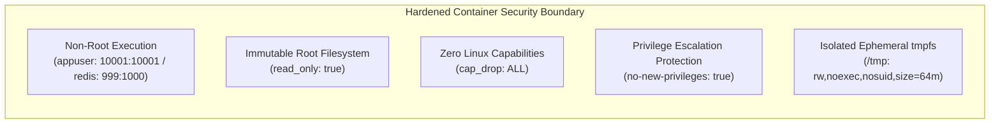
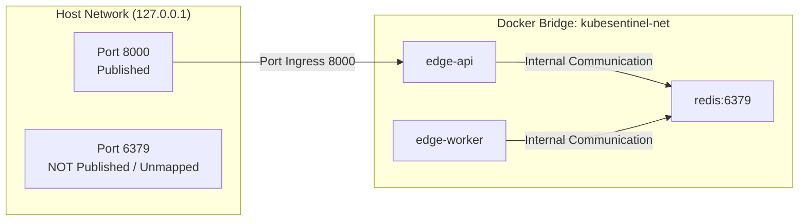

# Security Model — Milestone B Baseline

## 1. Executive Summary

Milestone B establishes a defense-in-depth security model for KubeSentinel prior to Kubernetes deployment. The controls focus on four core layers:
1. **Container Hardening**: Immutable, non-root runtimes with zero Linux capabilities.
2. **Network Isolation**: Strict internal bridge network boundaries with zero host exposure of the message broker.
3. **Data Path & Broker ACLs**: Principle of least privilege enforced across Redis operations.
4. **Secret Management**: Cryptographically generated local tokens, git-ignored configuration, and zero credential leakage.

---

## 2. Container Hardening Architecture



### 1. Non-Root Execution
- **Application Services (`edge-api`, `edge-worker`)**: Multi-stage Dockerfiles create a dedicated unprivileged user and group:
  ```dockerfile
  RUN groupadd -g 10001 appuser && \
      useradd -u 10001 -g 10001 -s /sbin/nologin -M appuser
  USER 10001:10001
  ```
- **Redis Services (`redis`, `redis-bootstrap`)**: Set to explicit UID/GID `999:1000` (`user: "999:1000"` in `docker-compose.yml`), ensuring processes start directly as the unprivileged alpine `redis` user and eliminating root setuid wrappers (`su-exec`).

### 2. Read-Only Root Filesystem (`read_only: true`)
All service containers mount their root filesystems as read-only. This neutralizes common post-exploitation vectors, including:
- Web shell deposition.
- System binary replacement or library hijacking.
- Arbitrary package installation or persistence mechanisms.

### 3. Dropped Linux Capabilities (`cap_drop: [ALL]`)
Every container strips all Linux capabilities from its execution context. Attackers cannot:
- Mount or remount filesystems (`CAP_SYS_ADMIN`).
- Forge network packets or perform raw socket sniffing (`CAP_NET_RAW`, `CAP_NET_ADMIN`).
- Change user IDs or group IDs (`CAP_SETUID`, `CAP_SETGID`).
- Override filesystem access controls (`CAP_DAC_OVERRIDE`).

### 4. Privilege Escalation Prevention (`no-new-privileges: true`)
The `security_opt: [no-new-privileges:true]` flag ensures that a process and its children cannot gain additional privileges through `setuid` or `setgid` binaries.

### 5. Ephemeral Temporary Storage (`tmpfs`)
When temporary file storage is required (e.g., Python bytecode compilation caches or runtime socket handles), containers utilize strictly isolated, memory-backed `tmpfs` mounts:
- `/tmp:rw,noexec,nosuid,size=64m` for application containers.
- `/tmp:rw,noexec,nosuid,size=16m` for Redis.

---

## 3. Network Isolation & Port Exposure



- **Zero Host Exposure of Redis**: Port 6379 is **unmapped** to the host. External network attackers, local non-container processes, and adjacent host interfaces cannot communicate directly with Redis.
- **Dedicated Bridge Network**: All container-to-container communication occurs over isolated internal bridge network `kubesentinel-net`.
- **Public Surface Minimization**: The only host-published port in the entire stack is `edge-api` on `127.0.0.1:8000` for HTTP event submission.

---

## 4. Secret Management & Credential Hygiene

1. **Cryptographic Token Generation**:
   Local credentials are generated via Python's standard `secrets` library (`secrets.token_urlsafe(32)`), providing 256 bits of entropy per role:
   - `REDIS_PRODUCER_PASSWORD`
   - `REDIS_CONSUMER_PASSWORD`
   - `REDIS_BOOTSTRAP_PASSWORD`
2. **Strict File Isolation**:
   - Generated secrets are written to `.env.local` and `deploy/compose/redis/users.acl` with restrictive file permissions (`0600`).
   - Both files are tracked in `.gitignore` and verified uncommitted via automated tests (`test_git_status.py`).
   - Only `.env.example` containing non-sensitive placeholder variables is tracked in version control.
3. **Zero Secret Leakage Invariant**:
   - CLI commands (`bootstrap-local`, `compose-up`, `smoke`) and application loggers redact passwords from standard output and error logs.
   - Test suites and evidence collection scripts sanitize all outputs to guarantee that no credentials appear in repository artifacts.

---

## 5. Principle of Least Privilege in Redis ACLs

| Identity | Allowed Commands | Allowed Keys | Scope & Invariants |
| :--- | :--- | :--- | :--- |
| **`default`** | None (`-@all`) | None | Completely disabled (`off`). |
| **`producer`** | `+auth +ping +xadd` | `~security-events` | Used by `edge-api`. Denied `XREADGROUP`, `XACK`, and all admin commands. |
| **`consumer`** | `+auth +ping +xreadgroup +xack` | `~security-events` | Used by `edge-worker`. Denied `XADD` and all admin commands. |
| **`bootstrap`**| `+auth +ping +xgroup +xinfo +xpending` | `~security-events` | Used strictly by ephemeral setup container. Never used at runtime. |

---

## 6. Deferred Security Controls (Future Milestones)

The following enterprise security controls are planned for future Kubernetes milestones and are intentionally **out of scope** for Milestone B:
- Kubernetes Pod Security Standards (PSS) & Admission Enforcement.
- Kubernetes NetworkPolicies (egress/ingress microsegmentation).
- Kubernetes RBAC & ServiceAccount token projection.
- Falco Kernel Runtime Threat Detection & Rule Engines.
- Kyverno Admission Control & Policy Auditing.
- Redis TLS Transport Layer Security & Certificate Management.
- HashiCorp Vault / External Secret Operators.
