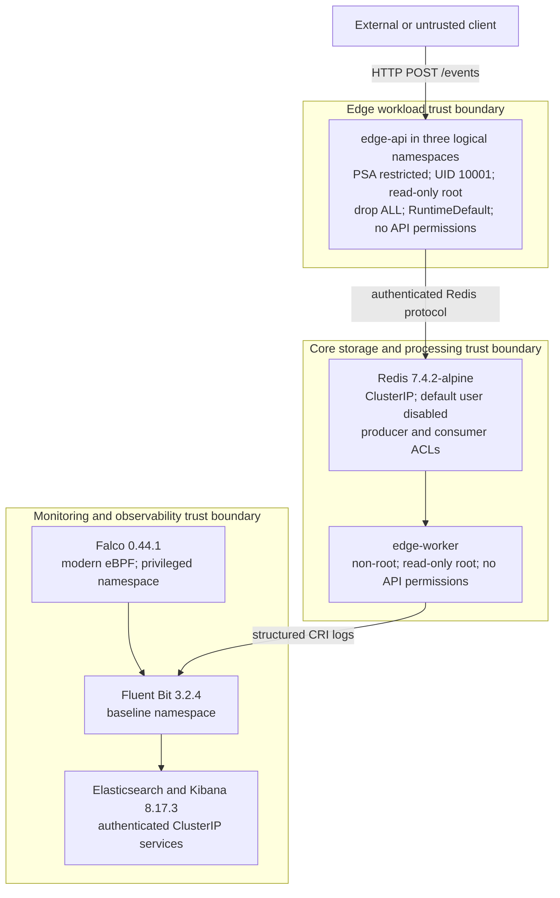

# KubeSentinel Threat Model & Security Control Architecture

## 1. System Overview & Trust Boundaries

KubeSentinel models three logical edge sites in one Kubernetes (`k3s`) cluster. It accepts edge telemetry over HTTP, buffers events in authenticated Redis Streams, processes them with a dedicated consumer, and sends application and Falco runtime telemetry to Elasticsearch.

### Trust Boundaries



---

## 2. Threat Actors & Attack Vectors

| Threat Actor | Motivation & Profile | Primary Attack Vectors |
| :--- | :--- | :--- |
| **External Untrusted Caller** | Threat actor attempting to breach edge services or flood message brokers | Malformed payloads, high-frequency request floods, injection attacks against `POST /events` |
| **Compromised Container (Post-Exploitation)** | Adversary who gained code execution in an edge pod | Interactive shell spawning (`/bin/sh`, `/bin/bash`), filesystem tampering, container escape |
| **Lateral Intrusive Adversary** | Compromised tenant attempting cross-workload pivot | Connecting to Redis without authorization, attempting cross-namespace network traversal |
| **Rogue Service Account / Malicious Insider** | Low-privilege identity attempting privilege escalation | Interrogating Kubernetes API server for secrets, configmaps, or cluster resources |
| **Misconfigured Workload / Shadow IT** | Developer deploying insecure or unhardened containers | Deploying `:latest` tags, running as root, requesting host namespaces, omitting resource quotas |

---

## 3. Defense-in-Depth: Prevention vs. Detection Controls

A fundamental requirement of the KubeSentinel security architecture is the rigorous distinction between **Preventative Controls** and **Detective Controls**.

### 3.1 Preventative Controls (Boundary & Gatekeeper Enforcement)

Preventative controls eliminate threats before execution begins. They operate at kernel network filters, API admission webhooks, RBAC authorizers, and database authentication engines:

1. **NetworkPolicy Segmentation (L3/L4 Packet Filtering)**:
   - **Mechanism**: Kubernetes NetworkPolicies enforce default-deny ingress and egress across edge and storage namespaces.
   - **Enforcement**: Only authorized TCP traffic to `redis.kubesentinel-system.svc.cluster.local:6379` from designated edge workloads is permitted. All cross-edge attempts (`edge-pune` -> `edge-mumbai`) and unauthorized access from other namespaces (`observability` -> Redis) are dropped at the network stack.
   - **Outcome**: Packets dropped; TCP connection resets / timeouts returned.

2. **Kyverno Policy-as-Code (Admission Webhook Enforcement)**:
   - **Mechanism**: Dynamic admission controller intercepting all workload creation and update requests.
   - **Enforcement**: Blocks non-compliant workloads before they are persisted to etcd (e.g. prohibiting `latest` tags, requiring CPU/memory limits, enforcing non-root execution, dropping all capabilities).
   - **Outcome**: Workload rejected synchronously at the API gateway with HTTP 400/403.

3. **Pod Security Admission (PSA Restricted Baseline)**:
   - **Mechanism**: Built-in Kubernetes admission controller evaluating pod security standards.
   - **Enforcement**: Prevents scheduling of pods requesting host network, host PID, privileged flags, or non-default capabilities.
   - **Outcome**: Pod creation denied.

4. **Kubernetes RBAC (Least Privilege Authorization)**:
   - **Mechanism**: Kubernetes API server authorizer evaluating ServiceAccount tokens.
   - **Enforcement**: Application ServiceAccounts (`edge-api-sa`, `edge-worker-sa`) have `automountServiceAccountToken: false` and zero ClusterRoleBindings.
   - **Outcome**: Unauthorized API calls (e.g., `GET /api/v1/namespaces/kube-system/secrets`) fail immediately with `HTTP 403 Forbidden`.

5. **Redis ACL Security (Application Data-Layer Least Privilege)**:
   - **Mechanism**: Redis 7.4 ACL engine validating user identities, permitted command sets, and stream keys.
   - **Enforcement**: Unauthenticated access is disabled (`user default off`). `producer` is restricted strictly to `XADD security-events` (denied `XREADGROUP`, `CONFIG`, admin commands). `consumer` is restricted strictly to `XREADGROUP` and `XACK`.
   - **Outcome**: Unauthorized commands rejected with `(error) NOPERM` or `(error) WRONGPASS`.

#### The Preventative Telemetry Gap (Architectural Fact)

> **Important Architectural Telemetry Reality**:
> In standard Kubernetes and Linux kernel topologies without dedicated eBPF flow loggers or audit streaming daemons:
> - NetworkPolicy packet drops do not emit application logs or syslog events by default.
> - Kyverno admission denials are recorded in ephemeral controller logs but are not routed into Elasticsearch index templates.
> - Kubernetes API 403 Forbidden events are recorded in local apiserver audit logs, but no `kubesentinel-audit-*` pipeline is active in this cluster.
> - Redis ACL command denials (`NOPERM`) do not trigger alerts in Falco or Fluent Bit.
>
> **Design Principle**: KubeSentinel explicitly acknowledges these prevention-layer telemetry gaps rather than fabricating fake detection rules. When a preventative control succeeds, the threat is stopped at the perimeter; no runtime alert is created in Elasticsearch because no runtime execution ever occurred.

---

### 3.2 Detective Controls (Runtime Observability & Threat Hunting)

Detective controls operate when an action is executed inside an active container runtime. They provide visibility, threat detection, alerting, and forensic triage:

1. **Falco Kernel-Space eBPF Syscall Monitor**:
   - **Mechanism**: Falco 0.44.1 runs with the `modern_ebpf` probe hooked into Linux kernel tracepoints (`sys_enter`, `sys_exit`).
   - **Enforcement**: Monitors process executions, socket binds, and namespace activity across all nodes.
   - **Custom Rule**: Evaluates process executions against the rule:
     ```yaml
     rule: Unexpected shell in KubeSentinel edge workload
     desc: Detect fork/exec of shell binaries inside edge workload containers
     condition: >
       spawned_process and container and
       k8s.ns.name in (edge-pune, edge-mumbai, edge-bangalore) and
       container.name in (edge-api, edge-worker) and
       proc.name in (sh, bash, ash, zsh)
     priority: WARNING
     ```
   - **Output**: Emits structured JSON alerts containing container name, pod name, namespace, user UID, and process command line (`proc_cmdline`).

2. **Fluent Bit Telemetry Pipeline**:
   - **Mechanism**: Fluent Bit 3.2.4 DaemonSet tailing node CRI container logs and Falco output logs.
   - **Enforcement**: Parses structured JSON, enriches records with Kubernetes Downward API metadata, and dispatches records to dedicated Elasticsearch indices based on tag routing (`kubesentinel-app-*` vs `kubesentinel-falco-*`).

3. **Elasticsearch Detections & Threat Hunting**:
   - **Mechanism**: Automated detection queries and hunting rules executed against indexed telemetry.
   - **Coverage**:
      - *Detection 1 (Unexpected Shell)*: ATT&CK T1059.004 — flags interactive or automated shell executions in edge workloads.
      - *Detection 2 (High-Severity App Event Triage)*: operational triage for high/critical application events and worker stream-processing anomalies; no ATT&CK technique is assigned because severity alone is not technique evidence.
      - *Detection 3 (General Falco Runtime Alert Hunt)*: baseline hunting query across heterogeneous cluster runtime alerts; no single ATT&CK technique is assigned.

---

## 4. Controlled Security Scenarios Matrix

The table below maps the five controlled simulation scenarios to their enforcement layer, relevant ATT&CK context, expected outcome, and telemetry boundary:

| Scenario | Control Type | Primary Control | MITRE ATT&CK | Expected Result | Telemetry Status |
| :--- | :--- | :--- | :--- | :--- | :--- |
| **`shell`** | **Detection** | Falco eBPF probe | **T1059.004** (Unix Shell) | Shell command executes non-destructively; Falco triggers Warning alert; alert ingested into `kubesentinel-falco-*` | **Indexed & Validated** in Elasticsearch |
| **`redis-unauthorized`** | **Prevention** | NetworkPolicy + Redis ACL | None; control validation | (A) NetworkPolicy blocks TCP 6379 from unauthorized pod; (B) Redis ACL denies invalid password (`WRONGPASS`) and unauthorized commands (`NOPERM`) | **Prevented at boundary**; telemetry gap documented |
| **`rbac-denial`** | **Prevention** | Kubernetes RBAC Authorizer | **T1613** (Container & Resource Discovery) | ServiceAccount `edge-api-sa` denied `GET /api/v1/namespaces/kube-system/secrets` with HTTP 403 Forbidden | **Prevented at API layer**; API audit logs not indexed |
| **`insecure-deployment`** | **Prevention** | Kyverno Admission Controller | **T1610** (Deploy Container) | Admission webhook blocks non-compliant deployment violating `disallow-latest-tag` and `require-resource-requests-limits` | **Prevented before admission**; Webhook rejection not indexed |
| **`lateral-access`** | **Prevention** | NetworkPolicy Segmentation | **T1021** (Remote Services) | Outbound socket and HTTP probe from `edge-pune` to `edge-mumbai` rejected with connection reset / timeout | **Prevented at packet filter**; Packet drops not indexed |

---

## 5. CI/CD & Supply Chain Compromise Threat Model

The delivery pipeline and artifact supply chain introduce additional trust boundaries. KubeSentinel's release workflow addresses four related risk areas:

### 5.1 Vulnerable Dependencies & Base Image Tampering
- **Threat Vector**: Malicious or vulnerable packages introduced via upstream Python dependencies (`requirements.txt`) or container base images (e.g. Debian/Alpine).
- **Control Mechanisms**:
  - **Pinned Dependency Hashes**: Strict version pinning in `pyproject.toml` and lockfiles.
  - **Automated Security Scanning**: CI workflow (`.github/workflows/security.yml`) integrates containerized Trivy vulnerability scanning. Enforces build failure on fixable `HIGH` and `CRITICAL` findings in project code.
  - **Software Bill of Materials (SBOM)**: Generation of CycloneDX and SPDX JSON SBOMs (`artifacts/sbom/`) for `edge-api` and `edge-worker`, providing transparent inventory with SHA-256 integrity checksums.

### 5.2 CI/CD Workflow Hijacking & Credential Poisoning
- **Threat Vector**: Malicious PRs exploiting automated GitHub Actions runners to exfiltrate repository secrets, execute arbitrary code, or tamper with release artifacts.
- **Control Mechanisms**:
  - **Least-Privilege Workflow Permissions**: All GitHub Actions workflows explicitly specify top-level `permissions: { contents: read }`.
  - **Zero `pull_request_target` Triggers**: Workflows avoid `pull_request_target` to eliminate dangerous checkout of untrusted PR code in privileged contexts.
  - **Pinned Action Commit SHAs**: All third-party GitHub Actions are pinned to full 40-character commit hashes (e.g. `actions/checkout@11bd719... # v4.2.2`) to prevent upstream action tag hijacking.

### 5.3 Mutable Image Tags & Image Spoofing
- **Threat Vector**: An adversary or misconfiguration deploys an image referencing the mutable `:latest` tag, resulting in unvetted code execution in production.
- **Control Mechanisms**:
  - **Deterministic Image Tags**: Build scripts generate non-latest, pinned version tags (e.g. `edge-api:1.0.0`, `edge-worker:1.0.0`).
  - **Admission Webhook Rejection**: Kyverno policy `disallow-latest-tag` dynamically intercepts and rejects any deployment referencing `:latest` at the cluster API boundary.

### 5.4 Accidental Secret Exposure
- **Threat Vector**: Committing API keys, database passwords, or private tokens to source control.
- **Control Mechanisms**:
  - **Strict Secret Hygiene**: Local runtime secrets (`.env.local`, live ACL files) are gitignored.
  - **Static Scanner Audits**: Automated filesystem scanning detects committed keys before release approval.

---

## 6. Residual Risks & Recommended Hardening

1. **Evasion Surface of Shell Binaries in Base Images**:
   - *Current State*: Container images are based on Debian/Alpine with `/bin/sh` present. An attacker with arbitrary command execution can invoke `/bin/sh`.
   - *Recommendation*: Migrate to distroless base images (e.g. `gcr.io/distroless/python3-debian12`) which completely remove shell interpreters, rendering shell execution impossible at the OS layer.

2. **Absence of Centralized Admission Webhook & Audit Ingestion**:
   - *Current State*: While Kyverno and Kubernetes RBAC prevent unauthorized actions, their denials are not indexed into Elasticsearch.
   - *Recommendation*: Configure Kubernetes API server audit logging with a webhook backend forwarding audit events to Fluent Bit for ingestion into `kubesentinel-audit-*`.

3. **Absence of L4 Flow Logging**:
   - *Current State*: NetworkPolicy drops packets silently at the Linux netfilter layer.
   - *Recommendation*: Deploy eBPF-based network flow telemetry (e.g. Cilium Hubble or Calico flow logs) to index dropped connection attempts as security telemetry in the SOC.
